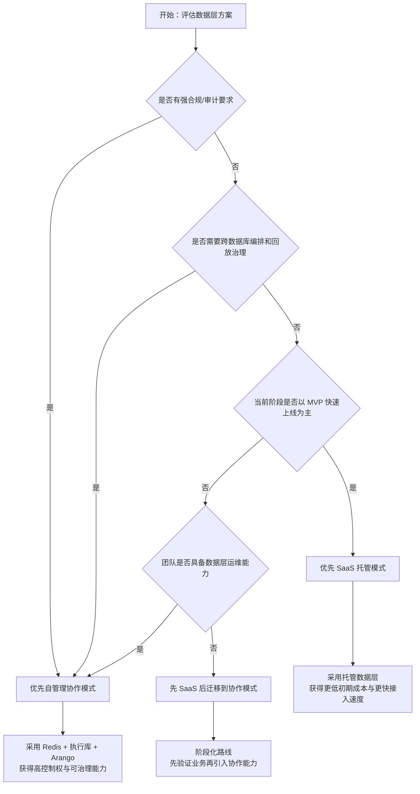

# EIT-DB - Go 数据库抽象层

一个受 Ecto (Elixir) 启发的 Go 数据库抽象层，提供类型安全的 Schema、Changeset 和跨数据库适配器支持。

## ✨ 特性

- **Schema 系统** - 声明式数据结构定义，支持验证器和默认值（支持从 Go 结构体自动生成）
- **Changeset 执行器（推荐）** - 业务写操作默认入口，支持基于 Changeset 的事务封装
- **Query Constructor (v2 推荐)** - 三层查询构造架构，支持 MySQL/PostgreSQL/SQLite/SQL Server 方言 (v0.4.1+)
- **Migration 工具** - 灵活的数据库迁移工具，支持 Schema-based 和 Raw SQL 两种方式
- **跨数据库适配器** - 支持 MySQL, PostgreSQL, SQLite, SQL Server, MongoDB, Neo4j, Redis, ArangoDB
- **查询构建器 (v1 兼容层)** - 保留兼容，不再新增能力
- **特性声明与派发** - Adapter 通过特性表声明能力，运行时按能力路由或降级
- **无 GORM 暴露** - 对外不再暴露 GORM（内部降级可能复用 GORM，但不会暴露给用户）
- **动态建表** - 支持运行时动态创建表；各 SQL Adapter 统一复用 Schema Builder 生成建表 SQL（PostgreSQL 自动模式仍使用触发器）
- **定时任务** - 跨数据库的定时任务支持
- **协作层（Redis + Arango）** - 支持协作消息、节点管理、在线状态投影与链路账本

## 📦 安装

```bash
go get github.com/eit-cms/eit-db
```

## 🚀 使用模式与配置（推荐先读）

EIT-DB 当前推荐两种运行模式：

1. 单适配器直连模式（默认）
- 适合绝大多数 CRUD 与单库业务。
- 仅创建一个 `Repository`，直接执行查询与写入。

2. 协作层组合模式（Redis + 业务适配器 + 可选 Arango）
- 适合跨适配器调度、消息协作、链路追踪与监控树场景。
- 当前是“能力组合模式”，不是一个全局开关。
- 实践上会并行创建多个 `Repository`：
  - Redis：协作消息与管理控制面
  - 业务适配器（如 PostgreSQL）：执行查询/写入
  - Arango（可选）：账本与在线节点投影

### 单适配器直连（示例）

```go
cfg := &db.Config{
    Adapter: "postgres",
    Postgres: &db.PostgresConnectionConfig{
        Host:     "127.0.0.1",
        Port:     5432,
        Username: "postgres",
        Password: "postgres",
        Database: "app",
        SSLMode:  "disable",
    },
}

repo, err := db.NewRepository(cfg)
if err != nil {
    panic(err)
}
defer repo.Close()
```

### 协作层组合（示例）

```go
redisRepo, _ := db.NewRepository(&db.Config{
    Adapter: "redis",
    Redis: &db.RedisConnectionConfig{Host: "127.0.0.1", Port: 56379},
})
postgresRepo, _ := db.NewRepository(&db.Config{
    Adapter: "postgres",
    Postgres: &db.PostgresConnectionConfig{Host: "127.0.0.1", Port: 55432, Username: "postgres", Database: "app", SSLMode: "disable"},
})
arangoRepo, _ := db.NewRepository(&db.Config{
    Adapter: "arango",
    Arango: &db.ArangoConnectionConfig{URI: "http://127.0.0.1:58529", Database: "_system", Namespace: "collab_prod"},
})

stream, _ := redisRepo.GetRedisStreamFeatures()          // 协作消息面
mgmt, _ := redisRepo.GetRedisManagementFeatures()        // 协作控制面
_ = stream
_ = mgmt

_ = postgresRepo
_ = arangoRepo
```

说明：

1. 协作层能力入口：`GetRedisStreamFeatures`、`GetRedisManagementFeatures`、`GetRedisSubscriberFeatures`。
2. Arango 侧协作账本入口：`RecordCollaborationEnvelopeToLedger`、`QueryLedgerDeliveryPath`、`QueryOnlineAdapterNodes`。
3. 如果你只做单数据库业务，不需要协作层，直接使用“单适配器直连模式”即可。

### 协作层端到端最小示例

下面的例子演示一条最小闭环：

1. 通过 Redis 管理面注册在线节点。
2. 通过 Redis Stream 发布并消费一条协作消息。
3. 将消息写入 Arango 账本。

```go
ctx := context.Background()

redisRepo, _ := db.NewRepository(&db.Config{
    Adapter: "redis",
    Redis: &db.RedisConnectionConfig{Host: "127.0.0.1", Port: 56379},
})
defer redisRepo.Close()

arangoRepo, _ := db.NewRepository(&db.Config{
    Adapter: "arango",
    Arango: &db.ArangoConnectionConfig{
        URI:       "http://127.0.0.1:58529",
        Database:  "_system",
        Namespace: "collab_demo",
    },
})
defer arangoRepo.Close()

_ = redisRepo.Connect(ctx)
_ = arangoRepo.Connect(ctx)

streamFeatures, _ := redisRepo.GetRedisStreamFeatures()
mgmtFeatures, _ := redisRepo.GetRedisManagementFeatures()

arangoAdapter, _ := arangoRepo.GetAdapter().(*db.ArangoAdapter)
_ = arangoAdapter.EnsureCollaborationLedgerCollections(ctx)

namespace := "collab_demo"
group := "adapter-postgres"
stream := "collab:demo:request"

node := &db.CollaborationAdapterNodePresence{
    NodeID:      "adapter-postgres-1",
    AdapterType: "postgres",
    AdapterID:   "managed-postgres",
    Group:       group,
    Namespace:   namespace,
}
_ = mgmtFeatures.RegisterAdapterNode(ctx, node, 30*time.Second)

_ = streamFeatures.EnsureConsumerGroup(ctx, stream, group)

env := &db.CollaborationMessageEnvelope{
    MessageID:      "msg-1",
    RequestID:      "req-1",
    TraceID:        "trace-1",
    SenderNodeID:   "adapter-api",
    ReceiverNodeID: node.NodeID,
    EventType:      "query.requested",
    IdempotencyKey: "idem-1",
    Payload: map[string]interface{}{
        "sql":  "SELECT 1",
        "hint": "demo",
    },
}
msgID, _ := streamFeatures.PublishEnvelope(ctx, stream, env)

messages, _ := streamFeatures.ReadGroupEnvelopes(ctx, stream, group, "consumer-demo", 1, 2*time.Second)
if len(messages) > 0 {
    _ = streamFeatures.Ack(ctx, stream, group, messages[0].ID)
    _ = arangoAdapter.RecordCollaborationEnvelopeToLedger(ctx, messages[0].Envelope)
}

paths, _ := arangoAdapter.QueryLedgerDeliveryPath(ctx, "req-1", 10)
fmt.Println("published message id:", msgID)
fmt.Println("ledger path rows:", len(paths))
```

建议：

1. 生产中使用唯一 `namespace` 隔离协作域，避免混用默认空间。
2. 将 `message_id`、`request_id`、`trace_id` 纳入日志字段，便于链路追踪。
3. 对消费端实现幂等检查，配合 `idempotency_key` 与 `ticks` 处理重复投递。

## 协作模式设计理念与取舍

这一章回答三个核心问题：

1. 为什么 EIT-DB 要做协作模式（Redis + 业务适配器 + Arango）。
2. 协作模式对业务有什么直接收益。
3. 与“把数据层托管给 SaaS”的方式相比，自己管理数据层的优劣势是什么。

### 1) 设计理念

EIT-DB 的协作模式不是为了替代数据库，而是把跨适配器协作中的三类职责拆开：

1. Redis 负责实时消息与控制面（低延迟、可恢复、可观察）。
2. 业务数据库负责执行真相（真正的数据读写和事务语义）。
3. Arango 负责关系账本与审计语义（链路追踪、回放规划、断点与跳转）。

这样做的目标是：

1. 主链路可用性优先：Arango 不可用时自动降级到 Redis-only，业务不被阻断。
2. 可治理优先：消息、节点、账本三层分离，定位问题时可以分层诊断。
3. 可演进优先：后续可以替换某一层实现，而不必重写全链路。

### 2) 协作模式的主要优点

1. 跨适配器编排能力更强：同一请求可在不同后端之间可追踪地流转。
2. 故障恢复能力更强：支持 DLQ 回放、断点续跑、任意锚点跳转。
3. 审计与排障路径清晰：`request_id` 可串联消息投递、消费、回放全流程。
4. 运行时弹性更高：Arango 失效时仍可用 Redis-only 维持核心服务。
5. 数据主权更明确：关键链路数据保留在自管基础设施中。

### 3) 代价与注意点

1. 基础设施复杂度增加：需要运维 Redis（可选 Arango）与业务库。
2. 工程约束更高：命名规范、幂等策略、TTL 策略需要团队一致执行。
3. 运行成本可能更高：初期比“全托管 SaaS”多一些部署与监控投入。
4. 团队能力要求更高：需要理解消息面、控制面、账本面的边界和责任。

### 4) 与数据层 SaaS 托管模式对比

| 对比项 | EIT-DB 协作模式（自管理数据层） | 数据层 SaaS 托管模式 |
|---|---|---|
| 数据控制权 | 高，可按组织规范控制存储、审计与保留策略 | 中到低，受 SaaS 平台能力与策略约束 |
| 可定制性 | 高，可按业务实现回放、路由、审计语义 | 中，通常受限于平台提供的能力面 |
| 故障隔离 | 强，可按层次隔离（消息/执行/账本） | 中，平台故障或限流影响面可能更集中 |
| 启动速度 | 中，需要搭建并治理多组件 | 高，开箱快，接入成本低 |
| 运维复杂度 | 高，需要自建监控、容量与升级策略 | 低到中，主要依赖平台 SLA |
| 长期成本结构 | 适合中长期规模化与深度定制场景 | 适合早期快速验证与小团队交付 |
| 合规与内控 | 适合强合规、强内控场景 | 取决于 SaaS 地域、合规等级与合同约束 |

### 5) 如何选型

#### 协作模式 vs SaaS 决策流程图



推荐优先自管理协作模式的场景：

1. 需要强审计、强合规、强内控。
2. 有跨数据库编排和复杂回放治理需求。
3. 业务生命周期长，且希望掌控核心数据链路。

推荐优先 SaaS 托管的场景：

1. MVP 或早期验证阶段，目标是快速上线。
2. 团队规模较小，暂时不希望承担数据层运维。
3. 对链路定制、回放治理、审计深度要求较低。

实践建议：

1. 可以先以 SaaS 方式快速验证业务，再逐步迁移到协作模式。
2. 如果一开始就有合规与审计硬要求，建议直接采用自管理协作模式。
3. 无论选哪种模式，都应先定义 `request_id` 级别的可观测标准。

## Adapter 注册机制

自定义适配器现在优先使用描述符注册机制。一个适配器的创建、专属配置校验和默认配置应通过一次 `RegisterAdapterDescriptor` 或 `MustRegisterAdapterDescriptor` 完成，而不是分散修改框架内部 switch/case。

```go
func init() {
    db.MustRegisterAdapterDescriptor("mydb", db.AdapterDescriptor{
        Factory: func(cfg *db.Config) (db.Adapter, error) {
            adapter, err := NewMyAdapter(cfg)
            if err != nil {
                return nil, err
            }
            if err := adapter.Connect(context.Background(), cfg); err != nil {
                return nil, err
            }
            return adapter, nil
        },
        ValidateConfig: func(cfg *db.Config) error {
            return nil
        },
        DefaultConfig: func() *db.Config {
            return &db.Config{Adapter: "mydb"}
        },
    })
}
```

旧版 `RegisterAdapter` 和 `RegisterAdapterConstructor` 仍然保留为兼容层，并会自动桥接到描述符注册表，避免已有代码立即失效。

注意：旧版兼容层计划在下一个 minor 版本移除。新代码应优先使用描述符注册机制。

## Adapter Metadata 最佳实践

从 v1.1 起，框架支持统一的 Adapter 元信息解析，推荐第三方适配器在描述符中显式提供 `Metadata`，避免运行时依赖类型推断。

```go
func init() {
    db.MustRegisterAdapterDescriptor("mydb", db.AdapterDescriptor{
        Factory: func(cfg *db.Config) (db.Adapter, error) {
            adapter, err := NewMyAdapter(cfg)
            if err != nil {
                return nil, err
            }
            if err := adapter.Connect(context.Background(), cfg); err != nil {
                return nil, err
            }
            return adapter, nil
        },
        ValidateConfig: func(cfg *db.Config) error {
            return nil
        },
        DefaultConfig: func() *db.Config {
            return &db.Config{Adapter: "mydb"}
        },
        Metadata: func() db.AdapterMetadata {
            return db.AdapterMetadata{
                Name:       "mydb",
                DriverKind: "document", // sql | document | graph | kv
                Vendor:     "acme",
                Version:    "1.x",
                Aliases:    []string{"acme-db"},
            }
        },
    })
}
```

如果你只拿到 Adapter 实例，也可以通过公开 API 获取统一元信息：

```go
meta := db.ResolveAdapterMetadata("", adapter)
fmt.Println(meta.Name)
```

如果你在 Repository 上下文中，直接使用：

```go
meta := repo.GetAdapterMetadata()
fmt.Println(meta.Name)
```

## 配置入口约定

EIT-DB 现在明确采用统一配置入口：新代码应通过 `Config`、`NewConfig`、`LoadConfig` 或适配器注册表提供配置，而不是再引入额外的环境变量配置入口。

`LoadConfigFromEnv`、`LoadConfigFromEnvWithDefaults` 和 `InitDBFromEnv` 仅作为旧版兼容层保留，不再扩展新适配器特性，计划在下一个 minor 版本移除。

### v1.1.2 - 定时任务增强与回退可观测性升级 (2026-04-22)

**核心变化**：补齐 SQL 适配器原生调度路径与统一 fallback reason 可观测性，提升跨适配器任务调度稳定性
## 🧪 选型决策树（30 秒）

按下面问题快速判断是否适合使用 EIT-DB：

1. 你的项目是否是多数据库或中大型系统，并且需要长期演进？
- 是：继续看第 2 条。
- 否：优先考虑 GORM。

2. 你是否需要数据库能力治理（能力声明、版本门槛、降级策略、运行时体检）？
- 是：继续看第 3 条。
- 否：优先考虑 GORM。

3. 你是否希望使用“数据库优先”的性能方案（视图组织 + 查询缓存 + 编译层扩展）？
- 是：EIT-DB 更适合。
- 否：继续看第 4 条。

4. 你团队是否能接受较多配置项，以换取更强的可控性和可扩展性？
- 是：EIT-DB 适合中长期建设。
- 否：建议使用 GORM 获得更轻量体验。

一句话判断：
- 追求数据库工程化、能力可治理、性能可演进：选 EIT-DB。
- 追求轻量开发、简单 CRUD、快速起步：选 GORM。

## 🗺️ 典型场景映射表

| 场景 | 推荐 | 原因 |
|---|---|---|
| 多数据库并存（如 MySQL + PostgreSQL + Neo4j） | EIT-DB | 能力声明 + 路由 + 降级机制更适合跨数据库治理 |
| 中大型 SaaS（多租户、长期演进） | EIT-DB | Schema/Changeset/迁移与能力体检更利于长期维护 |
| 读多写少且有热点查询 | EIT-DB | 可结合视图组织与查询缓存层降低重复构建和查询开销 |
| 需要严格控制数据库能力边界（版本、插件、运行时能力） | EIT-DB | 启动体检和能力矩阵可作为上线前门禁 |
| 复杂查询逐步扩展到多方言/多后端 | EIT-DB | Query IR + Compiler 架构降低方言演进成本 |
| 单体后台管理系统，主要是简单 CRUD | GORM | 开箱更轻量，配置少，上手快 |
| 小团队快速验证业务想法（MVP） | GORM | 更符合低心智负担、快交付目标 |
| 偏好传统 ORM 风格（尽量少配置） | GORM | EIT-DB 当前与后续都偏“可治理能力优先” |

建议：
- 如果你的系统生命周期较长、数据库能力差异明显，优先 EIT-DB。
- 如果你主要追求开发速度和轻量体验，优先 GORM。

## 🧭 项目能力总览（系统说明）

EIT-DB 面向“中到大型业务系统”的数据库工程实践，核心能力可分为 9 个模块：

1. Schema 与类型系统
- 声明式 Schema、字段约束、默认值、验证器。
- 支持从 Go 结构体反射生成 Schema，也支持手写精确定义。

2. Changeset 写模型
- 统一写入入口，支持变更跟踪、校验、事务封装。
- 推荐使用 ChangesetExecutor / WithChangeset，避免业务层直接操作底层事务原语。

3. Query Constructor v2
- 面向多方言的查询构造体系，支持条件组合、排序、分页、CTE/递归等能力映射。
- 配合特性声明和降级策略，在不同数据库间保持可预期行为。

4. Query IR 与编译层
- 引入 Query IR（中间表示）把“查询构造”与“目标语言编译”解耦。
- 通过编译器层（Compiler）把同一份查询语义编译为不同方言/后端语句，适配器可自定义增强。
- 这为 SQL 方言增强、未来 Cypher 等非 SQL 编译路径提供统一扩展位。

5. 数据库能力声明与执行路由
- 通过 DatabaseFeatures / QueryFeatures 声明数据库原生能力。
- 运行时按 native → custom → fallback → unsupported 路由执行。

6. 迁移与 DDL 路径统一
- 支持 Schema-based migration 与 Raw SQL。
- 框架工具表和动态表统一走 Schema Builder 路径，降低各 Adapter 手写 DDL 分叉成本。

7. 动态表与高级扩展能力
- 支持动态建表与按数据库特性执行高级能力。
- 包含 SQL Server / PostgreSQL 的高级能力封装，以及 Neo4j / MongoDB 的自定义能力路径。

8. 运行时能力体检
- 启动时可对 JSON / Full-text 等能力做 strict/lenient 体检。
- 适合生产环境做“能力一致性门禁”。

9. 查询缓存与性能加速
- 支持完整查询缓存与模板缓存。
- 采用专业缓存后端，支持容量控制、TTL 与命中统计。

更多能力边界与数据库矩阵请查阅 [docs/CAPABILITY_MATRIX.md](docs/CAPABILITY_MATRIX.md) 与 [docs/ARCHITECTURE.md](docs/ARCHITECTURE.md)。

## 🔗 关系语义策略（强/弱支持说明）

关系语义层（HasMany / BelongsTo / HasOne / ManyToMany + Through）的后端支持等级、
PG/MySQL 弱支持原因、PostgreSQL + AGE 说明、以及 SQL Server / MongoDB 策略配置，
统一维护在 [docs/RELATION_SEMANTICS.md](docs/RELATION_SEMANTICS.md)。

当前主口径（与后端无关化 API 演进保持一致）：

1. 图关系语义（Neo4j / Arango）= 强支持。
2. 外键 + JOIN 关系语义（SQL 后端）= 中支持。
3. 聚合模拟关系语义（MongoDB）= 弱支持。
4. 键值/流后端（Redis）= 关系语义不适用。

这意味着文档将逐步从“JOIN 支持率”转向“关系语义支持方式与程度”。

## 🔄 后端无关 API 改造方向（vNext）

为降低用户 API 心智负担，后续文档与接口将逐步收敛到：

1. 统一执行入口：`Query/Exec` 由适配器映射到 SQL/Cypher/AQL/聚合语义，不再要求用户显式区分 `ExecSQL/ExecCypher/ExecuteAQL` 风格入口。
2. 泛事务语义：支持多语句执行且具备原子提交语义的后端，统一视为支持事务语义；具体隔离级别与边界由适配器能力声明给出。
3. 查询语义优先：基于 Blueprint + 显式 Schema 关系注册驱动编译与路由，而不是仅按 SQL 方言能力做硬编码判断。

说明：上述为演进方向，现有稳定 API 与兼容路径仍可继续使用，迁移节奏以发布说明为准。

## ✅ 为什么要用 EIT-DB

如果你关注的是企业级数据库能力和长期演进成本，EIT-DB 的价值主要在以下几点：

1. 企业级能力覆盖
- 多数据库适配（MySQL / PostgreSQL / SQLite / SQL Server / MongoDB / Neo4j）。
- 能力声明、版本门槛、运行时探测、降级策略一体化。

2. 更贴近数据库生态
- 设计目标不是把数据库当成“被抽象掉的黑盒”，而是把数据库能力显式建模并利用起来。
- 核心理念：make full use of your database，而不是 use any database as a kv store。

3. 对性能优化更友好
- 支持基于视图的查询组织能力（尤其适用于跨表读模型优化）。
- 支持查询预编译缓存 / 模板缓存（含 TTL 与指标），减少重复构建与热点查询开销。

4. 架构创新可落地
- Query IR + Compiler 架构把“语义构造”和“方言编译”拆开，显著降低多数据库演进成本。
- 查询缓存层与 IR/Compiler 互补：前者解决重复构建的运行时开销，后者解决跨数据库编译的长期复杂度。
- 这类能力在传统 ORM 中通常依赖大量应用层补丁，而 EIT-DB 在数据库层抽象里原生提供。

5. 对复杂业务更稳健
- Changeset 写模型 + 能力路由 + 统一迁移路径，能显著降低“业务增长后重构数据库层”的风险。

6. 比传统“重应用层 ORM”方案更可控
- 明确数据库差异，避免在应用层堆叠过多补丁逻辑。
- 对数据库原生特性（JSON/FTS/递归/高级 DDL）的利用更直接。

## 🧠 Query IR 与缓存层的创新性与实用性

这两层是 EIT-DB 相对传统 ORM 的关键差异点：

1. Query IR / Compiler 的创新性
- 创新点：把 Query Builder 从“直接拼 SQL”升级为“先生成 IR，再由编译器输出目标语句”。
- 价值：同一查询语义可被不同后端复用，避免把方言细节扩散到业务层和构造层。
- 结果：新适配器或新方言扩展时，改动集中在编译层，维护边界更清晰。

2. 查询缓存层的创新性
- 创新点：不仅缓存最终 query+args，也支持“模板缓存（query + 参数位）”模式。
- 价值：对高频、同结构不同参数的查询，减少重复 Build 与字符串拼装成本。
- 结果：在热点读写路径中更稳定地控制 CPU 开销和延迟抖动。

3. 实用性（工程落地）
- 可配置容量、TTL、指标开关，适配从开发到生产的不同策略。
- 提供命中统计接口，便于做真实负载下的优化回路，而不是凭感觉调优。
- 与视图策略、能力路由一起形成“数据库优先”的性能优化链路。

## ❗ 什么情况下不推荐使用 EIT-DB

如果你的场景是“简单 CRUD + 少量业务逻辑 + 快速起步”，可以先不考虑 EIT-DB：

1. 只需要轻量数据库操作
- 若你不需要能力矩阵、降级路由、运行时体检、动态表、复杂迁移治理等能力，EIT-DB 可能偏重。

2. 更偏好传统 ORM 体验
- EIT-DB 当前配置项相对较多，后续企业能力扩展后配置项可能继续增加。
- 如果你追求极简、传统风格、快速上手体验，推荐优先使用 GORM。

3. 团队短期目标不是数据库工程化
- 当团队当前阶段更看重“少配置、快交付”，而非“数据库能力治理和演进”，EIT-DB 不一定是最佳选型。

## ❓ 常见问题（架构与设计）

### 1) 为什么采用 Adapter 模式，而不是传统 Active Record 风格？

短答：因为 EIT-DB 的目标是“多数据库能力治理”，而不是“单后端 ORM 便捷封装”。

1. Active Record 更偏向单数据库、模型即数据访问，跨后端能力差异不容易被显式管理。
2. Adapter + Features 可以把“数据库原生能力”和“降级策略”放在同一层治理。
3. 对复杂系统来说，查询编译、能力体检、回退路径都需要独立于业务模型演进。

### 2) 为什么图数据库与图功能在第一梯队支持？

1. 很多现代业务（社交、推荐、风控、关系分析）天然是关系图问题，而不是纯表结构问题。
2. 图能力如果放到后期补，通常会导致应用层出现大量关系拼接补丁，改造成本很高。
3. 提前把图能力纳入主路径，可统一关系语义与查询边界，避免后期“二次架构”。

### 3) 为什么所有 Adapter 放在主项目，而不是拆成独立子项目？

1. 能力矩阵、回退策略、Query IR 编译边界需要全局一致性，拆仓后更难同步。
2. 主仓协同可降低版本漂移和兼容矩阵失配风险。
3. 对用户而言，一个版本内拿到完整能力组合，升级和排障路径更短。

备注：当生态稳定后，可按成熟度逐步拆分 Provider，但不应在能力边界未稳定时过早拆仓。

### 4) 为什么用 Go，而不是 Java/C#/Rust？

1. Go 在“服务端基础设施 + 数据访问中间层”场景有很好的部署与运维效率。
2. 对多适配器网关和协作层这类组件，Go 的并发模型和二进制交付成本优势明显。
3. Java/C# 在企业生态很强，Rust 在性能和安全上很强，但当前项目优先级是工程可扩展性与交付效率平衡。

### 5) 为什么不做“数据库无差别抽象”，反而强调差异？

1. 现实中数据库能力并不等价，强行抹平会把复杂度转移到业务层。
2. EIT-DB 的策略是“显式差异 + 可控降级”，确保行为可解释、可观测、可审计。
3. 这对长期维护和故障诊断更友好。

### 6) 协作层会不会让系统复杂度过高？

1. 单库业务可以完全不用协作层。
2. 只有跨适配器调度、链路追踪、监控树场景才建议启用。
3. 通过能力视图组合而不是全局强绑定，降低了引入门槛。

### 7) 为什么还保留 fallback，不强制全量原生能力？

1. 生产环境常有能力差异（插件、版本、权限、运行时限制）。
2. fallback 让系统在能力缺失时可降级运行，避免核心流程硬中断。
3. 同时通过 reason 与体检报告保持可观测，防止“静默退化”。

## ⚡ 查询预编译与模板缓存

在高频查询场景下，可以把 Query Builder 的构建结果缓存下来复用，避免每次都重新 Build。
当前实现基于专业缓存库（Ristretto），默认最多保留 256 条编译结果；支持 TTL 过期和命中统计。

```go
cfg := &db.Config{
    Adapter: "sqlite",
    SQLite: &db.SQLiteConnectionConfig{Path: "./eit.db"},
    QueryCache: &db.QueryCacheConfig{
        MaxEntries:        512,
        DefaultTTLSeconds: 300,
        EnableMetrics:     true,
    },
}

repo, err := db.NewRepository(cfg)
if err != nil {
    panic(err)
}
```

### 1) 缓存完整编译结果（query + args）

适合参数固定的热点查询。

```go
qc, _ := repo.NewQueryConstructor(userSchema)
qc.Select("id", "name").Where(db.Eq("name", "alice")).Limit(10)

query, args, cacheHit, err := repo.BuildAndCacheQuery(ctx, "users:alice:top10", qc)
if err != nil {
    panic(err)
}

rows, err := repo.Query(ctx, query, args...)
_ = cacheHit // true 表示命中缓存，false 表示首次编译
```

### 2) 缓存查询模板（query + 参数位）

适合 SQL 结构固定但参数值频繁变化的场景。

```go
qc, _ := repo.NewQueryConstructor(userSchema)
qc.Select("id", "name").Where(db.Eq("id", 0)) // 仅用于构建模板形状

query, argCount, cacheHit, err := repo.BuildAndCacheQueryTemplate(ctx, "users:by_id", qc)
if err != nil {
    panic(err)
}

_ = query
_ = argCount
_ = cacheHit

row, err := repo.QueryRowWithCachedTemplate(ctx, "users:by_id", 1001)
if err != nil {
    panic(err)
}
```

还可直接使用：

- `StoreCompiledQueryTemplate`
- `QueryWithCachedTemplate`
- `ExecWithCachedTemplate`
- `InvalidateCompiledQuery`
- `ClearCompiledQueryCache`

说明：
- 完整查询缓存与模板缓存共享同一套缓存策略与容量预算。
- 模板缓存会校验参数个数，若传入参数数量不匹配会直接返回错误。
- 可通过 `repo.GetCompiledQueryCacheStats()` 读取命中/未命中等运行指标。
- 也可以通过环境变量覆盖配置：
    - `EIT_QUERY_CACHE_MAX_ENTRIES`
    - `EIT_QUERY_CACHE_DEFAULT_TTL_SECONDS`
    - `EIT_QUERY_CACHE_ENABLE_METRICS`

## 📌 发布与架构文档

- 架构文档：[docs/ARCHITECTURE.md](docs/ARCHITECTURE.md)
- 声明式优先配置（TOML）草案：[docs/DECLARATIVE_CONFIG_TOML_vNEXT.md](docs/DECLARATIVE_CONFIG_TOML_vNEXT.md)
- 协作层收尾任务清单：[docs/COLLAB_CLOSEOUT_TASKLIST_vNEXT.md](docs/COLLAB_CLOSEOUT_TASKLIST_vNEXT.md)
- 新 API 与迁移任务清单：[docs/API_AND_MIGRATION_TASKLIST_vNEXT.md](docs/API_AND_MIGRATION_TASKLIST_vNEXT.md)
- 协作层快速上手：[docs/COLLAB_QUICK_START.md](docs/COLLAB_QUICK_START.md)
- 架构决策 FAQ：[docs/ARCHITECTURE_FAQ.md](docs/ARCHITECTURE_FAQ.md)
- 后端无关 API 迁移指南（vNext 草案）：[docs/MIGRATION_GUIDE_BACKEND_AGNOSTIC_API_vNEXT.md](docs/MIGRATION_GUIDE_BACKEND_AGNOSTIC_API_vNEXT.md)
- v1.0 准入清单：[docs/V1_0_READINESS_CHECKLIST.md](docs/V1_0_READINESS_CHECKLIST.md)
- 发布门禁：[docs/RELEASE_GATE.md](docs/RELEASE_GATE.md)
- v1.1 升级指南（Schema/Query Builder）：[docs/MIGRATION_GUIDE_v1_1.md](docs/MIGRATION_GUIDE_v1_1.md)
- v1.0 升级指南：[docs/MIGRATION_GUIDE_v1_0.md](docs/MIGRATION_GUIDE_v1_0.md)
- v1.0 API 稳定性清单：[docs/API_STABILITY_v1_0.md](docs/API_STABILITY_v1_0.md)
- 能力矩阵：[docs/CAPABILITY_MATRIX.md](docs/CAPABILITY_MATRIX.md)

## 🗄️ Adapter 文档索引

每个适配器都有独立文档，包含快速开始、能力表、特色功能和降级策略：

- 自定义 Adapter 接入指南： [docs/ADAPTER_PROVIDER_GUIDE.md](docs/ADAPTER_PROVIDER_GUIDE.md)
- 自定义 Adapter 代码生成：`eit-db-cli adapter generate my_backend --kind mongo-like --dir adapter-providers --with-tests --split-features`
- 交互式向导生成：`eit-db-cli adapter generate --interactive`

| Adapter | 标识符 | 文档 |
|---|---|---|
| SQLite | `sqlite` | [docs/adapters/SQLITE.md](docs/adapters/SQLITE.md) |
| MySQL | `mysql` | [docs/adapters/MYSQL.md](docs/adapters/MYSQL.md) |
| PostgreSQL | `postgres` | [docs/adapters/POSTGRES.md](docs/adapters/POSTGRES.md) |
| SQL Server | `sqlserver` | [docs/adapters/SQLSERVER.md](docs/adapters/SQLSERVER.md) |
| MongoDB | `mongodb` | [docs/adapters/MONGODB.md](docs/adapters/MONGODB.md) |
| Neo4j | `neo4j` | [docs/adapters/NEO4J.md](docs/adapters/NEO4J.md) |
| Redis | `redis` | [docs/adapters/REDIS.md](docs/adapters/REDIS.md) |
| ArangoDB | `arango` | [docs/adapters/ARANGO.md](docs/adapters/ARANGO.md) |

- **Adapter 特性表**：每个数据库适配器通过 `DatabaseFeatures` / `QueryFeatures` 声明原生能力。
- **功能派发与降级**：按特性选择最佳实现，不支持的能力可降级到应用层策略。
- **Repository 统一入口**：所有读写通过 Repository，避免直接暴露底层 ORM。
- **Schema ⇄ Go 类型**：既支持手动 Schema，也支持从 Go 结构体反射生成。
- **动态表建表一致性**：动态表配置统一转换为 Schema，再经方言建表器生成 DDL，避免 Adapter 内手写 CREATE TABLE 分叉。

## 定时任务（能力补充）

### 调度语义（Native / Fallback）

Repository 在定时任务注册、注销、列表查询时，遵循以下路由语义：

1. 优先走 Adapter 原生调度能力（native）。
2. 若 Adapter 返回“需应用层回退”的错误，并且 `EnableScheduledTaskFallback` 开启（默认开启），自动切换到应用层 in-process cron 调度器。
3. 若 fallback 关闭，则直接返回 Adapter 错误。

### 共享 fallback API

- 哨兵错误：`ErrScheduledTaskFallbackRequired`
- 构造函数：`NewScheduledTaskFallbackErrorWithReason(adapter, reason, detail)`
- 兼容构造：`NewScheduledTaskFallbackError(adapter, detail)`
- 判断函数：`IsScheduledTaskFallbackError(err)`
- 原因提取：`ScheduledTaskFallbackReasonOf(err)`

### reason 枚举

- `adapter_unsupported`：该适配器不支持原生调度（如 SQLite/MongoDB/Neo4j/gorm wrapper）。
- `native_capability_missing`：适配器支持该路径，但当前运行环境缺失原生能力（如 SQL Server Agent 不可用、MySQL EVENT scheduler 关闭）。
- `cron_expression_unsupported`：原生调度器无法表达当前 cron 语义（如 SQL Server Agent 仅支持 `m h d * *` 月度形态）。
- `unknown`：兼容旧版错误文案或未标注 reason 的回退错误。

### 当前行为示例

- PostgreSQL：优先原生（函数 + 可选 pg_cron），不满足条件时可由 Repository 统一回退。
- SQL Server：Agent 不可用或 cron 形态不支持时，返回带 reason 的 fallback 错误，Repository 自动接管。
- MySQL：EVENT scheduler 不可用时，返回 `native_capability_missing`，Repository 自动接管。
- SQLite/MongoDB/Neo4j：直接返回 `adapter_unsupported`，由 Repository fallback 承接。

### 功能完成度报告

以下完成度基于当前代码路径与测试状态，面向“月度建表任务（`monthly_table_creation`）”能力。

| Adapter | 原生注册/注销/列表 | 原生调度能力探测 | 应用层 fallback 对接 | reason 可观测性 | 完成度 |
|---|---|---|---|---|---|
| PostgreSQL | 完整支持 | 支持（pg_cron 可选） | 支持（由 Repository 接管） | 支持 | 高（95%） |
| SQL Server | 完整支持 | 支持（Agent 可用性 + cron 形态） | 支持 | 支持 | 高（92%） |
| MySQL | 完整支持 | 支持（EVENT scheduler） | 支持 | 支持 | 高（90%） |
| SQLite | 原生不支持 | 不适用 | 支持（默认路径） | 支持 | 高（fallback 100%） |
| MongoDB | 原生不支持 | 不适用 | 支持（默认路径） | 支持 | 高（fallback 100%） |
| Neo4j | 原生不支持 | 不适用 | 支持（默认路径） | 支持 | 高（fallback 100%） |

说明：
- “完成度”以已实现能力覆盖和工程可用性衡量，不等同于所有数据库都具备同样原生调度器。
- 对无原生调度器的后端，目标是“可稳定 fallback + 可观测 + 可配置”。

### 使用指南

#### 1. 创建 Repository（默认开启 fallback）

```go
cfg := &db.Config{
    Adapter:  "postgres",
    Host:     "127.0.0.1",
    Port:     5432,
    Username: "postgres",
    Password: "postgres",
    Database: "app",
    SSLMode:  "disable",
}

repo, err := db.NewRepository(cfg)
if err != nil {
    panic(err)
}
defer repo.Close()
```

#### 2. 注册任务

```go
task := &db.ScheduledTaskConfig{
    Name:           "monthly_page_logs",
    Type:           db.TaskTypeMonthlyTableCreation,
    CronExpression: "0 0 1 * *",
    Description:    "create next month page log table",
    Enabled:        true,
    Config: map[string]interface{}{
        "tableName": "page_logs",
        "monthFormat": "2006_01",
        "fieldDefinitions": "id BIGSERIAL PRIMARY KEY, created_at TIMESTAMP DEFAULT CURRENT_TIMESTAMP",
    },
}

if err := repo.RegisterScheduledTask(ctx, task); err != nil {
    panic(err)
}
```

#### 3. 列表与状态观测

```go
tasks, err := repo.ListScheduledTasks(ctx)
if err != nil {
    panic(err)
}

for _, t := range tasks {
    fmt.Printf("name=%s type=%s running=%v next=%d info=%v\n", t.Name, t.Type, t.Running, t.NextExecutedAt, t.Info)
}
```

常见 `Info` 观测字段：
- 通用：`cron`, `schedule_mode`, `last_status`, `last_error`
- PostgreSQL：`pg_cron_job_id`, `pg_cron_schedule`, `pg_cron_last_status`
- SQL Server：`agent_job_name`, `agent_last_status`
- MySQL：`event_name`, `event_status`
- fallback：`mode=in_process_fallback`

#### 4. 注销任务

```go
if err := repo.UnregisterScheduledTask(ctx, "monthly_page_logs"); err != nil {
    panic(err)
}
```

#### 5. 控制 fallback 开关

默认开启。若希望“只允许原生调度，不允许应用层接管”，可显式关闭：

```go
disabled := false
cfg := &db.Config{
    Adapter:                      "sqlite",
    Database:                     ":memory:",
    EnableScheduledTaskFallback: &disabled,
}
```

#### 6. 在业务层识别 fallback 原因（可选）

```go
err := repo.RegisterScheduledTask(ctx, task)
if err != nil {
    if db.IsScheduledTaskFallbackError(err) {
        reason, _ := db.ScheduledTaskFallbackReasonOf(err)
        fmt.Printf("scheduled task fallback triggered, reason=%s, err=%v\n", reason, err)
    }
    return err
}
```

reason 取值：
- `adapter_unsupported`
- `native_capability_missing`
- `cron_expression_unsupported`
- `unknown`

#### 7. 推荐接入策略

1. 生产环境建议保留 fallback 开启，避免因环境差异导致任务注册失败。
2. 通过 `ScheduledTaskFallbackReasonOf` 记录指标，区分“能力缺失”与“表达式不兼容”。
3. 需要强约束环境一致性时，在预发/生产关闭 fallback，配合启动期能力检查做门禁。

## 🕸️ Neo4j 关系特性（新增）

Neo4j 在 EIT-DB 中将“外键能力”按关系语义建模：

- 不是 SQL FK 约束，但通过关系边表达关联，语义通常更强。
- 关系可携带属性（payload），可直接承载业务状态与元数据。
- 支持双向关系语义转换（例如好友请求从单向到双向）。
- 提供社交聊天预设模型：一对一聊天（双向关系可聊）与多人聊天室（双向 IN 可发言）。
- 提供已读回执和聊天治理预设：`READ_BY` / `MUTED_IN` / `BANNED_IN`。

### 1) 关系关联查询（无中间表）

```go
result, err := repo.ExecuteFeature(ctx, "relationship_association_query", "", map[string]interface{}{
    "from_label":   "User",
    "to_label":     "User",
    "relationship": "KNOWS",
    "direction":    "both", // out | in | both
})
```

### 2) 关系携带业务数据（payload）

```go
result, err := repo.ExecuteFeature(ctx, "relationship_with_payload", "", map[string]interface{}{
    "from_label":   "User",
    "to_label":     "User",
    "relationship": "KNOWS_REQUEST",
    "from_id":      "u1",
    "to_id":        "u2",
    "payload": map[string]interface{}{
        "message": "let's connect",
        "status":  "pending",
    },
})
```

### 3) 双向关系语义（请求 -> 好友）

```go
result, err := repo.ExecuteFeature(ctx, "bidirectional_relationship_semantics", "", map[string]interface{}{
    "from_id": "u1",
    "to_id":   "u2",
    // 可选：user_label/request_relationship/friend_relationship
})
```

说明：该能力默认将单向请求关系（KNOWS_REQUEST）转换为双向好友关系（KNOWS），用于“接受好友请求”这类常见社交语义。

### 4) 社交聊天预设模型（新增）

```go
// 一对一聊天：仅双向 FRIEND 或双向 FOLLOWS 可发送消息
dmModel, err := repo.ExecuteFeature(ctx, "social_model_one_to_one_chat", "", map[string]interface{}{})
if err != nil {
    panic(err)
}

// 多人聊天室：ChatRoom 单元 + 双向 IN 发言权限 + 单向 IN 入群申请
roomModel, err := repo.ExecuteFeature(ctx, "social_network_preset_model", "", map[string]interface{}{
    "preset": "group_chat_room",
})
if err != nil {
    panic(err)
}

_ = dmModel
_ = roomModel
```

说明：

1. 私聊消息采用中间节点 `ChatMessage`，关系为 `SENT -> TO`。
2. 群聊支持 `AT` 关系提及用户、`REF` 关系引用历史消息。
3. 聊天消息默认包含 `chat_message_fulltext`（`ChatMessage.content`）全文索引。
4. 检索模板支持时间窗口、软删除过滤、@ 命中加权。
5. 已读回执使用 `READ_BY`，治理策略使用 `MUTED_IN` / `BANNED_IN`。
6. 支持 Emoji 嵌入关系：`(:Emoji)-[:INCLUDED_BY {index}]->(:ChatMessage)` 对应消息中的 `{{0}}` 占位符，Emoji 作为静态节点可复用。
7. 详细查询模板见 [docs/adapters/NEO4J.md](docs/adapters/NEO4J.md)。

### 5) 为什么这类能力适合放在图数据库数据层

1. 把复杂关系规则（双向关系可聊、双向 IN 可发言、禁言/封禁）直接表达在图关系里，避免应用层重复实现。
2. API 可以只暴露有限、安全的业务入口，权限判定通过图查询模板统一执行。
3. 当关系模型迭代时，新增关系类型即可扩展能力，减少多服务联改和越权漏洞风险。

## 📝 MongoDB 文档编辑与渲染特性（新增）

MongoDB 在文档类业务（CMS/知识库/公告）中，常见需求是“草稿状态流转 + 模板渲染输出”。
EIT-DB 在 Adapter 层提供这组能力，目的不是替代业务层，而是把高频且重复的文档处理逻辑标准化：

1. 草稿状态语义统一：create/update/publish/archive/restore/query_plan。
2. 模板渲染入口统一：支持 Go 标准模板、预设模板库和安全策略。
3. 查询计划结构统一：便于 API 层、后台任务、运营脚本复用同一过滤约定。

### 快速使用

```go
// 1) 草稿管理
draftOut, err := repo.GetAdapter().ExecuteCustomFeature(ctx, "article_draft_management", map[string]interface{}{
    "operation": "create",
    "article": map[string]interface{}{
        "title": "Draft Title",
        "content": "Draft content",
    },
    "tags": []string{"cms", "mongodb"},
    "category": "tech",
})
if err != nil {
    panic(err)
}

// 2) 查询计划
planOut, err := repo.GetAdapter().ExecuteCustomFeature(ctx, "article_draft_query_plan", map[string]interface{}{
    "status": "published",
    "limit":  20,
    "skip":   0,
})
if err != nil {
    panic(err)
}

// 3) 使用预设模板渲染
renderOut, err := repo.GetAdapter().ExecuteCustomFeature(ctx, "article_template_rendering", map[string]interface{}{
    "template_preset": "news",
    "data": map[string]interface{}{
        "title": "Weekly Digest",
        "lead":  "Highlights",
        "content": "...",
        "reporter": "Team",
        "source": "Internal",
    },
    "strict_variables": true,
    "max_template_size": 4096,
})
if err != nil {
    panic(err)
}

_ = draftOut
_ = planOut
_ = renderOut
```

### REST API 映射建议

下面是推荐的后端路由映射，目标是让前后端在草稿流转、筛选列表和模板渲染上使用同一套语义。

| 场景 | 推荐路由 | 对应特性 |
|---|---|---|
| 创建/更新草稿 | POST /api/articles/draft | article_draft_management |
| 发布草稿 | POST /api/articles/publish | article_draft_management |
| 归档/恢复 | POST /api/articles/archive 或 /restore | article_draft_management |
| 文章列表查询计划 | POST /api/articles/query-plan | article_draft_query_plan |
| 模板列表 | GET /api/articles/templates/presets | article_template_preset_library |
| 模板渲染 | POST /api/articles/render | article_template_rendering |

请求示例（模板渲染）：

```json
{
    "template_preset": "news",
    "template_name": "news_card",
    "strict_variables": true,
    "max_template_size": 4096,
    "allowed_functions": ["trim", "upper", "join"],
    "data": {
        "title": "Weekly Digest",
        "lead": "Highlights",
        "content": "...",
        "reporter": "Team",
        "source": "Internal"
    }
}
```

响应建议：

1. 固定返回 strategy 字段，前端可据此区分渲染模式或列表模式。
2. 保留 query_plan 原样下发，便于后端网关或任务系统复用。
3. 透传 security_policy 到响应中，方便前端调试模板配置。

详细参数、预设模板和安全策略建议见：[docs/adapters/MONGODB.md](docs/adapters/MONGODB.md)。

### 1. 配置数据库连接

**使用 YAML 配置文件：**

```yaml
# config.yaml
database:
    adapter: sqlite
    sqlite:
        path: ./data/app.db
    pool:
        max_connections: 25
        idle_timeout: 300
```

**使用 YAML（协作层组合示例）：**

```yaml
# redis-config.yaml
database:
    adapter: redis
    redis:
        host: 127.0.0.1
        port: 56379
        db: 0

# arango-config.yaml
database:
    adapter: arango
    arango:
        uri: http://127.0.0.1:58529
        database: _system
        namespace: collab_prod
```

说明：

1. 单适配器模式：只需要一个 `database` 配置。
2. 协作层模式：通常会准备 Redis + 业务数据库 + 可选 Arango 三份配置，并在进程内创建多个 `Repository`。

**校验 locale 初始化配置（支持多 locale 同时启用）：**

```yaml
# config.yaml
database:
    adapter: sqlite
    sqlite:
        path: ./data/app.db
    validation:
        default_locale: zh-CN
        enabled_locales:
            - zh-CN
            - en-US
```

说明：
- `default_locale` 必须是已注册 locale。
- `enabled_locales` 支持多个 locale 同时启用；列表中每个 locale 都必须已注册。
- 当同时设置 `default_locale` 和 `enabled_locales` 时，`default_locale` 必须包含在 `enabled_locales` 中。
- `NewRepository` 初始化时会自动应用以上配置，未启用的 locale 不允许被设为当前 locale。

**PostgreSQL JSON 类型配置（默认 jsonb）：**

```yaml
database:
    adapter: postgres
    postgres:
        host: localhost
        port: 5432
        username: postgres
        database: app
        ssl_mode: disable
    options:
        postgres_json_type: jsonb # 可选: json | jsonb，默认 jsonb
```

说明：
- PostgreSQL 对 `TypeJSON` 默认映射为 `jsonb`。
- 可通过 `options.postgres_json_type`（或 `options.json_type`）切换为 `json`。
- 推荐优先使用 `jsonb`（索引与操作符能力更完整）。

**启动期能力体检（strict / lenient）：**

```yaml
database:
    adapter: sqlite
    sqlite:
        path: ./data/app.db
    startup_capabilities:
        mode: lenient # 可选: lenient | strict
        capability_modes:
            json_runtime: strict       # 全局 lenient 下，json 仍可强制一致性
            full_text_runtime: lenient # 允许降级
        inspect:
            - json_runtime
            - full_text_runtime
        required:
            - json_runtime
```

说明：
- `mode=lenient`：输出启动体检报告，不因能力不足阻塞启动。
- `mode=strict`：`required` 中任一能力不满足会直接初始化失败。
- `capability_modes`：按能力覆盖模式；可用于“全局 lenient + 单能力 strict”。
- 当前支持能力项：`json_runtime`、`full_text_runtime`。
- 初始化成功后可通过 `repo.GetStartupCapabilityReport()` 获取最近一次体检结果。

**推荐环境模板（dev / staging / prod）：**

开发环境（dev）：以开发效率优先，默认允许降级

```yaml
database:
    startup_capabilities:
        mode: lenient
        capability_modes:
            json_runtime: lenient
            full_text_runtime: lenient
        inspect:
            - json_runtime
            - full_text_runtime
```

预发布环境（staging）：提前锁定 JSON 一致性，全文允许降级

```yaml
database:
    startup_capabilities:
        mode: lenient
        capability_modes:
            json_runtime: strict
            full_text_runtime: lenient
        inspect:
            - json_runtime
            - full_text_runtime
```

生产环境（prod）：关键能力严格门禁

```yaml
database:
    startup_capabilities:
        mode: strict
        capability_modes:
            json_runtime: strict
            full_text_runtime: lenient
        inspect:
            - json_runtime
            - full_text_runtime
        required:
            - json_runtime
```

建议：
- 如果业务对全文检索排序/召回一致性有硬要求，可将 `full_text_runtime` 也改为 `strict`。
- 先在 staging 跑一周观察启动报告，再提升到 prod 策略。

#### 升级说明（v1.0 locale 配置）

如果你从旧版本升级到当前版本，请关注以下行为变化：

1. 初始化时机变化：
    - `validation` 配置会在 `NewRepository` 阶段统一应用，不再建议在业务入口分散设置全局 locale。

2. locale 可用性收紧：
    - 运行时 `SetValidationLocale(locale)` 只允许切换到已启用 locale。
    - 当请求上下文中传入未启用 locale 时，会自动回退到默认 locale。

3. 推荐迁移步骤：
    - 在配置文件中显式声明 `validation.default_locale` 与 `validation.enabled_locales`。
    - 对 CMS/多区域项目，统一启用需要的 locale 列表（例如 `zh-CN`、`en-US`）。
    - 若有自定义 profile，先注册 profile，再将其加入 `enabled_locales`。

**多 Adapter YAML 配置（新）：**

```yaml
# adapters.yaml
adapters:
    primary:
        adapter: postgres
        postgres:
            host: localhost
            port: 5432
            username: postgres
            password: ""
            database: app
            ssl_mode: disable

    search:
        adapter: mongodb
        mongodb:
            uri: "mongodb://localhost:27017"
            database: search_db
```

**使用多 Adapter 配置：**

```go
registry, err := eit_db.LoadAdapterRegistry("adapters.yaml")
if err != nil {
        panic(err)
}

if err := eit_db.RegisterAdapterConfigs(registry); err != nil {
        panic(err)
}

repo, err := eit_db.NewRepositoryFromAdapterConfig("primary")
if err != nil {
        panic(err)
}
defer repo.Close()
```

**或使用代码配置：**

```go
package main

import "github.com/eit-cms/eit-db"

func main() {
    config := &eit_db.Config{
        Adapter: "sqlite",
        SQLite: &eit_db.SQLiteConnectionConfig{
            Path: "./data/app.db",
        },
        Pool: &eit_db.PoolConfig{
            MaxConnections: 25,
            IdleTimeout:    300,
        },
    }
    
    repo, err := eit_db.NewRepository(config)
    if err != nil {
        panic(err)
    }
    defer repo.Close()
    
    // 现在可以使用 Repository API
}
```

### 2. 定义 Schema（手动）

```go
func BuildUserSchema() db.Schema {
    schema := db.NewBaseSchema("users").
        AddTimestamps().
        AddSoftDelete()
    
    schema.AddField(
        db.NewField("id", db.TypeInteger).
            PrimaryKey().
            Build(),
    )
    
    schema.AddField(
        db.NewField("email", db.TypeString).
            Null(false).
            Unique().
            Validate(&db.EmailValidator{}).
            Build(),
    )
    
    return schema
}
```

`AddTimestamps()` 会自动补齐 `created_at`、`updated_at`（`TypeTime`、`NOT NULL`、默认 `CURRENT_TIMESTAMP`）；
`AddSoftDelete()` 会补齐可空的 `deleted_at`。

时间类型默认映射（`TypeTime`）：

| 数据库 | 默认列类型 |
|---|---|
| PostgreSQL | `TIMESTAMP` |
| MySQL | `DATETIME` |
| SQLite | `DATETIME` |
| SQL Server | `DATETIME2` |

说明：
- 上表为 Schema Migration 的默认类型选择，用于兼顾跨库一致性与通用兼容。
- 如果业务对时区或精度有严格要求，建议在迁移中使用适配器定制 SQL（例如显式指定 `TIMESTAMP WITH TIME ZONE`、`DATETIME(6)` 等）。

应用层日期构建工具：

```go
// 1) 按年月日构建（默认 00:00:00）
deadline := db.DateByYMD(2027, 3, 17).Build()

// 2) 基于当前日期快速偏移
oneYearLater := db.OneYearLater()   // 一年后
twoMonthsLater := db.MonthsLater(2) // 两个月后

// 3) 链式构建
nextBilling := db.TodayBuilder().
    AddMonths(1).
    At(9, 0, 0).
    Build()

// 4) 月初/月末边界
monthStart := db.StartOfCurrentMonth()
monthEnd := db.EndOfCurrentMonth()

// 5) UTC 快捷函数
oneYearLaterUTC := db.OneYearLaterUTC()
nextMonthUTC := db.MonthsLaterUTC(1)

// 6) 季度边界
quarterStart := db.StartOfCurrentQuarter()
quarterEnd := db.EndOfCurrentQuarter()

// 7) 业务语义糖
nextInvoiceDate := db.NextBillingDate(15) // 下一个“每月 15 号”账单日
slaDue := db.SLADeadline(24, true)        // 24 个工作日小时后的截止时间
```

常用函数：
- `DateByYMD(year, month, day)`：按年月日创建 Builder。
- `TodayBuilder()`：基于今天创建 Builder（时分秒为 0）。
- `YearsLater(n)` / `MonthsLater(n)` / `DaysLater(n)`：快速获取未来日期。
- `OneYearLater()`：`YearsLater(1)` 语义糖。
- `StartOfMonth()` / `EndOfMonth()`：可在 Builder 上对齐到当月边界。
- `StartOfCurrentMonth()` / `EndOfCurrentMonth()`：快速获取当前月边界。
- `StartOfQuarter()` / `EndOfQuarter()`：可在 Builder 上对齐到当前季度边界。
- `StartOfCurrentQuarter()` / `EndOfCurrentQuarter()`：快速获取当前季度边界。
- `TodayUTCBuilder()` / `YearsLaterUTC(n)` / `MonthsLaterUTC(n)` / `DaysLaterUTC(n)`：UTC 版本工具。
- `OneYearLaterUTC()`：UTC 下的 `YearsLaterUTC(1)` 语义糖。
- `NextBillingDate(day)`：获取下一个账单日（超月末自动对齐）。
- `SLADeadline(hours, workdaysOnly)`：SLA 截止计算（支持仅工作日小时）。

日期条件已可直接纳入 Query Builder 工具链：

```go
qc, _ := repo.NewQueryConstructor(userSchema)

// 当天注册用户
qc.Where(db.DateOn("created_at", 2026, 3, 17))

// 当前月内活跃用户
qc.WhereAll(
    db.Eq("status", "active"),
    db.DateInCurrentMonth("updated_at"),
)

// 今天工作时段（例如 09:00-18:00）
qc.Where(db.DateInBusinessHours("created_at", 9, 18))

// 最近 5 个工作日（可附加节假日）
holiday := db.DateByYMD(2026, 10, 1).Build()
qc.Where(db.DateInLastBusinessDays("updated_at", 5, holiday))

// 自定义时间区间
start := db.DateByYMD(2026, 1, 1).Build()
end := db.DateByYMD(2026, 3, 31).EndOfMonth().Build()
qc.Where(db.DateRange("created_at", start, end))
```

可用日期条件：
- `DateOn(field, year, month, day)`：某一天（闭开区间）。
- `DateFrom(field, start)` / `DateTo(field, end)`：起止边界条件。
- `DateRange(field, start, end)`：时间区间（自动纠正 start/end 顺序）。
- `DateInCurrentMonth(field)` / `DateInCurrentQuarter(field)`：当前月/季度窗口。
- `DateInBusinessHours(field, startHour, endHour)`：当前日期工作时段窗口（支持跨天）。
- `DateInLastBusinessDays(field, n, holidays...)`：最近 N 个工作日窗口（跳过周末与节假日）。

预置组合条件（业务语义糖）：

```go
// 活跃用户 + 工作时段（默认 status=active, updated_at, 09:00-18:00）
qc.Where(db.ActiveUsersInBusinessHours())

// 订单在当前季度（默认 created_at）
qc.Where(db.OrdersInCurrentQuarter())

// 待处理任务在未来 N 个工作日内到期（默认 status=pending, due_at）
holiday := db.DateByYMD(2026, 10, 1).Build()
qc.Where(db.DueSoonTasksInBusinessDays(3, holiday))

// 统一入口（推荐，便于后续扩展其他模块）
qc.Where(db.Presets.Date.ActiveUsersInBusinessHours())
qc.Where(db.Presets.Date.OrdersInCurrentQuarter())
qc.Where(db.Presets.Date.DueSoonTasksInBusinessDays(3, holiday))
```

可配置版本：
- `ActiveUsersInBusinessHoursBy(statusField, activeValue, timeField, startHour, endHour)`
- `OrdersInCurrentQuarterBy(timeField)`

说明：
- 现有顶层函数保持兼容可继续使用。
- 建议新代码优先使用 `Presets` 入口，后续其他模块会逐步纳入该命名空间。
- `Presets` 仅承载应用层语义预置；Mongo/Neo4j/SQL 方言等 Adapter 细节预置单独维护，不放入这里。
- 分层与命名规范见：[docs/PRESETS_CONVENTIONS.md](docs/PRESETS_CONVENTIONS.md)。

自动分表（基于自动建表上层 API）：

```go
// 1) 按数据规模（哈希槽）分表
scaleTpl := db.NewDataScaleShardingTemplate("tenant_id", 16)

// 2) 按日期分表（年 / 月 / 日）
dateTpl := db.NewDateShardingTemplate("created_at", db.DateShardingByMonth)

// 3) 按地区分表
regionTpl := db.NewRegionShardingTemplate("region", "cn", "us", "eu")

manager, _ := db.NewAutoShardingManager(hook, "orders_dynamic", dateTpl)
tableName, _ := manager.EnsureShardTable(ctx, map[string]interface{}{
    "created_at": "2026-03-17",
})

// 稳定性检查工具：验证模板在样本数据上的稳定性与分片数量边界
tool := db.NewShardingStabilityTool()
report := tool.ValidateTemplate(dateTpl, []map[string]interface{}{
    {"created_at": "2026-03-01"},
    {"created_at": "2026-03-17"},
}, 12)

// 风险等级：low / medium / high
if report.RiskLevel == db.ShardingRiskHigh {
    // 可在发布流程中阻断上线
}

// 发布门禁辅助：
if !report.CanRelease() {
    reasons := report.ReleaseBlockReasons()
    _ = reasons // 可直接上报到 CI / 发布系统
}

// 分表命名校验（非法字符、超长、重复）
namingErrs := tool.ValidateShardNaming("orders", []string{"202603", "202604"})
_ = namingErrs
_ = report
_ = tableName
_ = scaleTpl
_ = regionTpl
```

说明：
- `AutoShardingManager` 会先根据模板计算 shard id，再委托 `DynamicTableHook.CreateDynamicTable` 确保子表存在。
- 当前实现是应用层模板路由，不依赖 Adapter 私有类型，便于跨数据库统一使用。
- 稳定性工具会输出热分片告警（`HotShards`）与迁移建议（`Recommendations`），用于提前治理分片偏斜。
- `ValidateShardNaming` 可在上线前做分表命名体检，降低跨数据库命名兼容风险。
- `RiskLevel` 可直接用于运维看板或发布门禁（high 建议阻断，medium 建议人工确认）。
- `CanRelease()` / `ReleaseBlockReasons()` 可直接作为 CI 门禁输入。

### 3. 定义 Schema（从 Go 结构体生成）

```go
type User struct {
    ID        int       `eit_db:"id,primary_key,auto_increment"`
    Email     string    `eit_db:"email,unique,not_null"`
    CreatedAt time.Time `eit_db:"created_at"`
}

schema, err := db.InferSchema(User{})
if err != nil {
    panic(err)
}

// 建议优先使用 eit_db tag，避免与其他库常见的 db tag 命名冲突。
```

兼容策略时间线见：[docs/REFLECTION_GUIDE.md](docs/REFLECTION_GUIDE.md)。

### 4. 使用 Changeset 进行业务写操作（推荐）

业务层默认应通过 Changeset 执行器写数据，而不是直接使用底层事务原语。

```go
repo, err := db.NewRepository(config)
if err != nil {
    panic(err)
}
defer repo.Close()

userSchema := BuildUserSchema()

executor, err := repo.NewChangesetExecutor(context.Background(), userSchema)
if err != nil {
    panic(err)
}

cs := db.NewChangeset(userSchema)
cs.Cast(map[string]interface{}{
    "email": "alice@example.com",
}).Validate()

if !cs.IsValid() {
    panic(cs.ErrorString())
}

_, err = executor.Insert(cs)
if err != nil {
    panic(err)
}
```

多步写操作请使用 `WithChangeset`：

```go
err := repo.WithChangeset(context.Background(), userSchema, func(executor *db.ChangesetExecutor) error {
    first := db.NewChangeset(userSchema).
        Cast(map[string]interface{}{"email": "alice@example.com"}).
        Validate()
    if !first.IsValid() {
        return fmt.Errorf(first.ErrorString())
    }
    if _, err := executor.Insert(first); err != nil {
        return err
    }

    second := db.NewChangeset(userSchema).
        Cast(map[string]interface{}{"email": "bob@example.com"}).
        Validate()
    if !second.IsValid() {
        return fmt.Errorf(second.ErrorString())
    }
    _, err := executor.Insert(second)
    return err
})
if err != nil {
    panic(err)
}
```

`Repository.Begin` 仍可用于底层集成（迁移、框架内部等），但不建议业务层直接作为默认写路径。

### 4.1 Changeset 验证能力

```go
// 创建 Changeset
cs := db.NewChangeset(userSchema)
cs.Cast(map[string]interface{}{
    "name":  "Alice",
    "email": "alice@example.com",
    "age":   25,
})

// 链式验证
cs.ValidateRequired([]string{"name", "email"}).
   ValidateLength("name", 2, 50).
   ValidateFormat("email", `^[a-zA-Z0-9._%+-]+@[a-zA-Z0-9.-]+\.[a-zA-Z]{2,}$`).
   ValidateNumber("age", map[string]interface{}{"greater_than_or_equal_to": 18.0})

// 检查验证结果
if cs.IsValid() {
    // 数据有效，可以保存
    data := cs.GetChanges()
} else {
    // 显示错误
    for field, errors := range cs.Errors() {
        fmt.Printf("%s: %v\n", field, errors)
    }
}
```

**可用的验证方法：**
- `ValidateRequired(fields)` - 验证必填字段
- `ValidateLength(field, min, max)` - 验证字符串长度
- `ValidateFormat(field, pattern)` - 正则表达式验证
- `ValidateInclusion(field, list)` - 白名单验证
- `ValidateExclusion(field, list)` - 黑名单验证
- `ValidateNumber(field, opts)` - 数字范围验证

**locale 与 Changeset 联动：**
- 可通过 `changeset.ValidateWithLocale(locale)` 按指定 locale 执行校验。
- 可通过 `changeset.ValidateWithContext(ctx)` + `WithValidationLocale(ctx, locale)` 在请求上下文中透传 locale。
- 当上下文 locale 未启用时，系统会自动回退到当前默认 locale。

### 5. 查询构造器（v2 推荐）

v2 是当前推荐入口，默认提供方言标识符引用、参数化占位符和条件组合能力。

```go
repo, err := db.NewRepository(config)
if err != nil {
    panic(err)
}
defer repo.Close()

schema := db.NewBaseSchema("users")

qc, err := repo.NewQueryConstructor(schema)
if err != nil {
    panic(err)
}

sql, args, err := qc.
    Select("id", "email").
    Where(db.Eq("status", "active")).
    OrderBy("created_at", "DESC").
    Limit(20).
    Build(context.Background())
if err != nil {
    panic(err)
}

rows, err := repo.Query(context.Background(), sql, args...)
_ = rows
_ = err
```

#### 统一 Query/Exec 自动路由（跨 Adapter）

当你不想手动区分“这是查询还是写入”时，可直接使用自动路由入口：

```go
result, err := repo.ExecuteQueryConstructorAuto(ctx, qc)
if err != nil {
    panic(err)
}

switch result.Mode {
case "query":
    fmt.Println("rows:", len(result.Rows))
case "exec":
    if result.Exec != nil {
        fmt.Println("affected:", result.Exec.RowsAffected)
    }
}
```

自动路由语义：
- SQL：`SELECT/WITH...SELECT` 走 Query，其余走 Exec。
- Neo4j：`MATCH/RETURN/CALL...YIELD` 走 Query，其余走 `ExecCypher`。
- MongoDB：支持 `MongoQueryConstructor` 编译出的 `MONGO_FIND::`（query）与 `MONGO_WRITE::`（exec）计划。

返回结果字段对照见：[docs/AUTO_EXEC_RESULT_MATRIX.md](docs/AUTO_EXEC_RESULT_MATRIX.md)

MongoDB 写入可选详情：

```go
schema := db.NewBaseSchema("users")
qc, _ := repo.NewQueryConstructor(schema)
mongoQC := qc.GetNativeBuilder().(*db.MongoQueryConstructor)

result, err := repo.ExecuteQueryConstructorAuto(ctx,
    mongoQC.
        InsertOne(map[string]interface{}{"name": "alice"}).
        ReturnInsertedID().
        ReturnWriteDetail(),
)
if err != nil {
    panic(err)
}

fmt.Println(result.Exec.RowsAffected)
fmt.Println(result.Exec.Counters)
fmt.Println(result.Exec.Details) // inserted_id / inserted_ids / matched_count / modified_count / deleted_count ...
```

#### 兼容路径（仅历史项目）

v1 `NewQueryBuilder` 仍可用，但仅用于历史项目兼容，不建议新代码使用：
- 默认会打印一次迁移提示
- 可通过 `db.SetLegacyQueryBuilderWarningEnabled(false)` 关闭提示
- 新功能只保证在 v2 + Changeset 执行器路径持续演进

#### SQLite JSON 降级语义（QueryFeatures）

SQLite 的 `json_path` 在 QueryFeatures 中按如下顺序处理：

1. 优先使用 SQLite JSON1 扩展（原生 `json_extract`）。
2. 若运行环境缺失 JSON1，可注册自定义函数 `JSON_EXTRACT_GO`（`custom_function` 降级）。
3. 若未注册自定义函数，再回退到应用层解析（`application_layer`）。

可通过 QueryFeatures 获取当前策略：

```go
qf := db.NewSQLiteQueryFeatures()

fallback := qf.GetFallbackStrategy("json_path")
note := qf.GetFeatureNote("json_path")
alt := qf.GetAlternativeSyntax("json_path")

fmt.Println(fallback) // custom_function
fmt.Println(note)
fmt.Println(alt)      // SELECT JSON_EXTRACT_GO(payload, '$.path') FROM ...
```

如需启用 `JSON_EXTRACT_GO`，可参考 SQLite 自定义函数注册能力（见 `sqlite_custom_functions.go`）。

### 6. 数据库迁移工具 (v1.0.0+)

EIT-DB 提供了强大的迁移工具，支持两种迁移方式：

> 命令统一说明：
> - 主入口：`eit-db-cli`
> - 兼容别名：`eit-migrate`（继续可用）
> - 兼容策略：旧别名仅做兼容，新功能优先且仅保证在 `eit-db-cli` 下持续演进。

**初始化迁移项目：**
```bash
# 安装工具
go install github.com/eit-cms/eit-db/cmd/eit-migrate@latest

# 或直接构建
cd /path/to/eit-db
go build -o ~/bin/eit-db-cli ./cmd/eit-migrate

# 初始化迁移项目
eit-db-cli init
```

**生成迁移文件：**
```bash
# 生成 Schema-based 迁移（类型安全）
eit-db-cli generate create_users_table

# 生成 Raw SQL 迁移（完全控制）
eit-db-cli generate add_indexes --type sql
```

**运行迁移：**
```bash
cd migrations
cp .env.example .env
# 编辑 .env 配置数据库连接

# 运行迁移
go run . up

# 查看状态
go run . status

# 回滚最后一个迁移
go run . down
```

**Schema-based Migration 示例：**
```go
func NewMigration_20260203150405_CreateUsersTable() db.MigrationInterface {
    migration := db.NewSchemaMigration("20260203150405", "create_users_table")

    userSchema := db.NewBaseSchema("users")
    userSchema.AddField(&db.Field{
        Name:    "id",
        Type:    db.TypeInteger,
        Primary: true,
        Autoinc: true,
    })
    userSchema.AddField(&db.Field{
        Name: "email",
        Type: db.TypeString,
        Null: false,
        Unique: true,
    })

    migration.CreateTable(userSchema)
    return migration
}
```

**Raw SQL Migration 示例：**
```go
func NewMigration_20260203160000_AddIndexes() db.MigrationInterface {
    migration := db.NewRawSQLMigration("20260203160000", "add_indexes")

    migration.AddUpSQL(`
        CREATE INDEX idx_users_email ON users(email);
        CREATE INDEX idx_posts_user_id ON posts(user_id);
    `)

    migration.AddDownSQL(`
        DROP INDEX idx_users_email;
        DROP INDEX idx_posts_user_id;
    `)

    return migration
}
```

**详细文档：**
- [Migration 完整指南](.dev-docs/MIGRATION_GUIDE.md) - 深入了解所有功能
- [快速开始](.dev-docs/QUICK_START_MIGRATION.md) - 5分钟上手指南

## 🗄️ 支持的数据库

| 数据库 | 适配器 | 状态 |
|--------|--------|------|
| SQLite | sqlite | ✅ |
| MySQL | mysql | ✅ |
| PostgreSQL | postgres | ✅ |
| SQL Server | sqlserver | ✅ |
| MongoDB | mongo | ✅ |
| Neo4j | neo4j | ✅ |

## 📖 文档

- [架构总览](docs/ARCHITECTURE.md) - 当前架构与路线图目标对齐说明
- [声明式优先配置（TOML）草案](docs/DECLARATIVE_CONFIG_TOML_vNEXT.md) - 统一适配器/协作层/Blueprint/Schema/Relation/Query Module 的声明式配置方案
- [协作层收尾任务清单](docs/COLLAB_CLOSEOUT_TASKLIST_vNEXT.md) - 协作层进入新 API 改造前的收尾 Gate 与验收标准
- [协作层快速上手](docs/COLLAB_QUICK_START.md) - 10-15 分钟跑通消息链路，含回放增强与冒烟测试命令
- [协作层 PR 报告（2026-04-28）](docs/dev/PR_REPORT_COLLAB_REPLAY_SMOKE_20260428.md) - 本轮回放增强与测试补强的变更摘要、验证与风险
- [新 API 与迁移任务清单](docs/API_AND_MIGRATION_TASKLIST_vNEXT.md) - 统一 Query/Exec、事务语义泛化与迁移执行计划
- [v1.1.2 Release Notes](docs/RELEASE_NOTES_v1_1_2.md) - 定时任务增强与 fallback 可观测性说明
- [v1.1.1 Release Notes](docs/RELEASE_NOTES_v1_1.md) - 小版本优化与 NoSQL 特色能力发布说明
- [v1.1 路线图](docs/V1_1_ROADMAP.md) - 迁移入口统一与 MongoDB/Neo4j 迁移接入目标
- [v1.1 升级指南（Schema/Query Builder）](docs/MIGRATION_GUIDE_v1_1.md) - Schema 关系注册与 Query Builder API 迁移说明
- [后端无关 API 迁移指南（vNext 草案）](docs/MIGRATION_GUIDE_BACKEND_AGNOSTIC_API_vNEXT.md) - 统一 Query/Exec、泛事务语义与关系语义分级迁移路径
- [v1.1 迁移工具说明](docs/MIGRATION_TOOL_GUIDE_v1_1.md) - Schema/RawSQL 双入口策略与使用规范
- [v1.0 升级指南](docs/MIGRATION_GUIDE_v1_0.md) - 从 v0.x 到 v1.0 的迁移步骤与验收清单
- [v1.0 API 稳定性清单](docs/API_STABILITY_v1_0.md) - Stable/Compat/Internal 承诺边界
- [能力支持矩阵](docs/CAPABILITY_MATRIX.md) - 数据库/版本/插件/降级路径一览
- [Migration 工具完整指南](.dev-docs/MIGRATION_GUIDE.md) - 数据库迁移工具使用说明
- [Migration 快速开始](.dev-docs/QUICK_START_MIGRATION.md) - 5分钟上手迁移工具
- [动态建表功能详解](.dev-docs/DYNAMIC_TABLE.md) - SaaS 多租户、分表分库等场景
- [快速参考和常见问题](.dev-docs/QUICK_REFERENCE.md)
- [v0.1.4 版本修复说明和完整使用指南](.dev-docs/FIXES_AND_TESTS.md)  
- [版本发布说明](.dev-docs/SUMMARY.md)
- [v1.0.0 路线图](.dev-docs/v1.0.0_ROADMAP.md)
- [v0.3.0 开发进度](.dev-docs/v0.3.0-PROGRESS.md)

## ❓ 常见问题

### PostgreSQL 连接失败

检查是否在使用信任认证。如果使用信任认证，确保密码字段为空字符串：

```go
config := &eit_db.Config{
    Adapter: "postgres",
    Postgres: &eit_db.PostgresConnectionConfig{
        Username: "postgres",
        Password: "", // 信任认证
        Database: "myapp",
        SSLMode:  "disable",
    },
}
```

### MySQL 连接失败

确保 MySQL 服务器正在运行，用户名和密码正确：

```go
config := &eit_db.Config{
    Adapter: "mysql",
    MySQL: &eit_db.MySQLConnectionConfig{
        Host:     "localhost",
        Port:     3306,
        Username: "root",
        Password: "password",
        Database: "myapp",
    },
}
```

### QueryBuilder v1 提示如何关闭

如果你在增量迁移期间暂时继续使用 `NewQueryBuilder`，可以关闭兼容提示：

```go
db.SetLegacyQueryBuilderWarningEnabled(false)
```

### 为什么 `Repository.Begin` 会打印提示

`Repository.Begin` 被视为底层事务原语，主要面向迁移与框架集成。
业务层推荐使用 `NewChangesetExecutor` 或 `WithChangeset`，这样默认不会绕过 Changeset 校验与统一写入路径。

如确有底层事务场景，可按需关闭提示：

```go
db.SetLowLevelTransactionWarningEnabled(false)
```

## 🧪 测试

运行所有测试：

```bash
go test -v ./...
```

运行特定测试：

```bash
# Changeset 验证测试
go test -v -run TestValidate

# 适配器测试
go test -v -run TestSQLiteAdapterInitialization

# 动态表测试
go test -v -run TestDynamicTable
```

性能基准测试：

```bash
go test -bench=. -benchmem
```

## 📊 版本更新

### v1.1.2 - 定时任务增强与回退可观测性升级 (2026-04-22)

**核心里程碑**：将定时任务能力从“可回退可用”推进到“原生优先 + 回退标准化 + 可观测”

- ✅ PostgreSQL / SQL Server / MySQL 定时任务原生路径完善（注册/注销/列表与元数据状态）
- ✅ 应用层 fallback 语义标准化：`ErrScheduledTaskFallbackRequired` + 结构化 reason
- ✅ reason 体系落地：`adapter_unsupported` / `native_capability_missing` / `cron_expression_unsupported` / `unknown`
- ✅ Repository 在 register/unregister/list 路径统一接管 fallback，行为一致性提升
- ✅ README 补齐“能力补充”章节，含完成度矩阵与接入/观测指南
- ✅ 回归测试通过：`go test ./... -run 'ScheduledTask|DynamicTable'`

### v1.1.1 - NoSQL 特色能力增强与任务调度优化 (2026-03-23)

**核心里程碑**：补齐可直接复用的 NoSQL 特色能力模板，让应用层从“重复造轮子”转向“组合调用”

- ✅ 定时任务覆盖策略升级：适配器不支持原生任务时，Repository 层可回退到统一调度器（默认开启，可配置关闭）
- ✅ MongoDB 新增日志与文档工作流特色能力：热词分析、规则分词、草稿管理、模板渲染与模板库
- ✅ Neo4j 社交/聊天预置模型增强：一对一聊天、群聊、已读回执、禁言/封禁、消息全文检索
- ✅ 表情语义模型改进：静态 Emoji 节点可复用，使用 `INCLUDED_BY(index)` 与消息占位符绑定
- ✅ 文档与测试完善：README + 适配器文档同步更新，回归测试通过

### v1.1.0 - 关系语义与多后端策略升级 (2026-03-20)

**核心里程碑**：关系语义从“隐式外键推断”升级为“Schema 显式注册 + 适配器策略执行”

- ✅ 新增 Schema 关系注册能力：`HasMany` / `HasOne` / `BelongsTo` / `ManyToMany(...).Through(...)`
- ✅ 关系元数据进入 Query IR，编译层可按后端做差异化优化
- ✅ MongoDB 支持语义化 JoinWith，新增 `lookup` / `pipeline` 策略与 through 产物折叠控制
- ✅ SQL Server 新增 many-to-many 策略：`direct_join` / `recursive_cte`，支持深度与 MAXRECURSION 配置
- ✅ Neo4j 支持命名关系类型映射，ManyToMany through 可编译为两跳关系路径
- ✅ 文档升级为单一事实源：关系语义、能力矩阵、架构说明统一对齐

---

### v1.0.0 - 正式版发布 (2026-03-18)

**核心里程碑**：API 边界稳定、发布门验证通过、完成 v1 正式发布

- ✅ 业务写路径统一到 Changeset（`WithChangeset` / `NewChangesetExecutor`）
- ✅ Adapter 能力路由与运行时检查收敛
- ✅ `GetGormDB` 兼容保留但固定返回 `nil`，不再暴露 ORM
- ✅ Query Constructor v2 成为推荐入口，v1 保留兼容
- ✅ 发布门（Release Gate）完整通过（含可选 DB 套件）

---

### v0.4.2 - SQL Server Adapter (2026-02-03)

**核心新增**：SQL Server 数据库支持，验证三层查询构造架构的扩展性

**SQLServerDialect 实现**
- ✅ 方括号标识符引用：`[table].[column]` 而非反引号或双引号
- ✅ @pN 参数占位符：`@p1`, `@p2` 而非 `?` 或 `$1`
- ✅ SQL Server 专属分页语法：`OFFSET n ROWS FETCH NEXT m ROWS ONLY`
- ✅ 完整的三层架构兼容性验证

**SQLServerAdapter 实现**
- ✅ 基于 github.com/microsoft/go-mssqldb 和 gorm.io/driver/sqlserver
- ✅ 默认端口 1433，支持连接池配置
- ✅ 完整的事务支持（Commit/Rollback/Exec/Query/QueryRow）
- ✅ GetQueryBuilderProvider() 返回 SQL Server 方言提供者

**测试覆盖**
- ✅ TestSQLServerDialect：5个测试用例验证 SQL 生成
- ✅ TestSQLServerIdentifierQuoting：方括号引用验证
- ✅ TestSQLServerComplexQuery：复杂查询验证
- ✅ TestSQLServerDialectQuotingComparison：跨方言对比测试
- ✅ 所有现有测试继续通过，100% 向后兼容

**架构验证**：SQL Server 的独特语法完美融入三层架构，证明设计的可扩展性

---

### v0.4.1 - 查询构造器三层架构 (2026-02-03)

**核心改进**：建立查询构造器的三层分离架构，为 v0.5.0+ 多 Adapter 支持打基础

**顶层 - 用户 API 层**
- ✅ `QueryConstructor` 接口：用户通过此接口构建查询
- ✅ 流式 API：`Where()`, `WhereAll()`, `WhereAny()`, `Select()`, `OrderBy()`, `Limit()`, `Offset()`
- ✅ 灵活的条件构造器：`Eq()`, `Ne()`, `Gt()`, `Lt()`, `Gte()`, `Lte()`, `In()`, `Between()`, `Like()`
- ✅ 复合条件：`And()`, `Or()`, `Not()`

**中层 - Adapter 转义层**
- ✅ `QueryConstructorProvider` 接口：每个 Adapter 通过此接口提供数据库特定的实现
- ✅ `QueryBuilderCapabilities` 结构体：声明 Adapter 支持的操作和优化特性
- ✅ 方言无关的 API 设计

**底层 - 数据库执行层**
- ✅ `SQLQueryConstructor` 实现：标准 SQL 生成
- ✅ `SQLDialect` 接口：支持不同的 SQL 方言
- ✅ 方言实现：`MySQLDialect`, `PostgreSQLDialect`, `SQLiteDialect`
- ✅ 参数化查询：防止 SQL 注入，自动转换为 `?` 或 `$1` 等占位符

**测试覆盖**：20+ 单元测试，验证每个条件、操作符和组合的 SQL 生成正确性  

### v0.4.0 - Migration 工具 (2026-02-03)

✅ 全新的数据库迁移工具  
✅ 支持 Schema-based 和 Raw SQL 两种迁移方式  
✅ 命令行工具（当前主入口 `eit-db-cli`，兼容别名 `eit-migrate`）  
✅ 自动版本管理和状态追踪  
✅ 支持跨数据库和非关系型数据库  

### v0.3.1 - Changeset 增强 (2026-02-03)

✅ 新增 7 个验证方法（Required, Length, Format, Inclusion, Exclusion, Number, GetChange）  
✅ 完整的测试套件  
✅ 修复 TestDynamicTableConfigBuilder 测试  

### v0.1.4 - 稳定性修复 (2026-02-02)

✅ 修复 MySQL 驱动连接与初始化问题  
✅ 修复 PostgreSQL 认证 "role does not exist" 问题  
✅ 改进连接池配置，完整支持 MaxLifetime  
✅ 增强错误诊断信息，包含完整的连接参数  
✅ 添加完整的测试套件（10+ 测试用例）  
✅ 100% 向后兼容  

详见 [版本修复说明](.dev-docs/FIXES_AND_TESTS.md)

## 🔗 相关链接

- [Elixir Ecto 文档](https://hexdocs.pm/ecto)
- [GitHub Repository](https://github.com/deathcodebind/eit-db)
- [适配器工作流文档](./.dev-docs/ADAPTER_WORKFLOW.md)
- [测试覆盖范围](./.dev-docs/TEST_COVERAGE.md)

## 🧪 测试

### 单元测试

运行核心库测试：

```bash
go test ./... -v
```

### 集成测试

测试所有适配器（SQLite 无需依赖，PostgreSQL/MySQL 需要 Docker）：

```bash
# 仅 SQLite 测试（推荐开发期间使用）
go test ./adapter-application-tests -v

# 或使用测试脚本
./test.sh integration

# 完整测试（启动所有数据库 + 运行测试）
./test.sh all-keep
```

### 使用 Docker 运行完整测试

```bash
# 启动 PostgreSQL、MySQL、SQL Server 容器
./test.sh start

# 运行所有测试
./test.sh integration

# 停止容器
./test.sh stop

# 或一步完成
./test.sh all
```

### 测试覆盖范围

详见 [测试覆盖范围文档](./.dev-docs/TEST_COVERAGE.md)

**已验证的功能：**

- ✅ SQLite: CRUD、CTE、窗口函数、JSON、事务、UPSERT
- ✅ 多适配器管理：反射注册、YAML 配置、工厂模式
- ✅ QueryFeatures：版本感知、优先级路由、特性声明
- ⏭️ PostgreSQL：物化视图、数组、全文搜索、JSONB
- ⏭️ MySQL：全文搜索、JSON、窗口函数、ON DUPLICATE KEY
- ⏭️ SQL Server：MERGE、递归 CTE、临时表

## 📝 许可证

MIT License

## 📧 支持

如有问题或建议，欢迎提交 Issue 或 Pull Request。

---

**最后更新**：2026-04-22  
**当前版本**：v1.1.2（Patch 发布）
