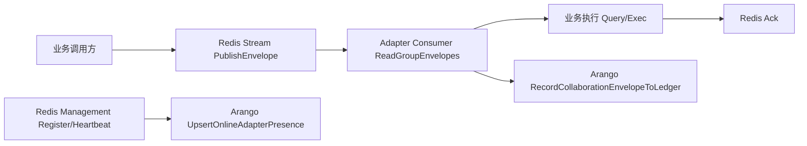
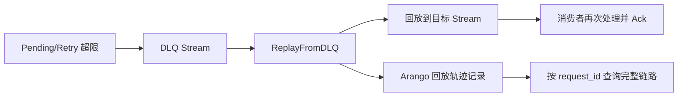

# Collaboration Quick Start (Redis + Arango)

本指南用于 10-15 分钟内跑通 EIT-DB 协作层最小闭环：

1. Redis 作为消息与管理控制面。
2. PostgreSQL（或其他业务适配器）作为执行面。
3. Arango 作为链路账本与在线节点投影。

协作层默认运行口径（vNext）：

1. 默认启用 Redis + Arango 双面协作。
2. Arango 为默认增强面（链路追踪、关系审计、回放辅助规划）。
3. Arango 不可用时自动降级为 fallback（Redis-only），主链路不阻断。

## 0. 完整消息流程图（推荐先读）

### 0.1 正常链路（投递、消费、入账）



### 0.2 异常链路（DLQ 与回放）



开发者建议：

1. 回放状态机与 `request_id` 图查询模板，见 `docs/adapters/ARANGO.md` 的“回放判定状态机（Arango 增强优先）”与“request_id 维度图查询示例”章节。
2. 生产排障优先按 `request_id` 聚合查看：投递 -> 消费 -> 回放三段轨迹。

## 1. 启动依赖

在项目根目录执行：

```bash
docker compose up -d postgres redis arango && docker compose ps
```

默认端口（本仓库集成测试环境）：

1. PostgreSQL: `55432`
2. Redis: `56379`
3. ArangoDB: `58529`

## 2. 创建三个 Repository

```go
ctx := context.Background()

redisRepo, _ := db.NewRepository(&db.Config{
    Adapter: "redis",
    Redis: &db.RedisConnectionConfig{Host: "127.0.0.1", Port: 56379, DB: 0},
})
postgresRepo, _ := db.NewRepository(&db.Config{
    Adapter: "postgres",
    Postgres: &db.PostgresConnectionConfig{
        Host: "127.0.0.1", Port: 55432, Username: "postgres", Password: "postgres", Database: "postgres", SSLMode: "disable",
    },
})
arangoRepo, _ := db.NewRepository(&db.Config{
    Adapter: "arango",
    Arango: &db.ArangoConnectionConfig{URI: "http://127.0.0.1:58529", Database: "_system", Namespace: "collab_demo"},
})

defer redisRepo.Close()
defer postgresRepo.Close()
defer arangoRepo.Close()

_ = redisRepo.Connect(ctx)
_ = postgresRepo.Connect(ctx)
_ = arangoRepo.Connect(ctx)
```

## 3. 获取协作能力视图

```go
stream, _ := redisRepo.GetRedisStreamFeatures()
mgmt, _ := redisRepo.GetRedisManagementFeatures()
sub, _ := redisRepo.GetRedisSubscriberFeatures()

_ = sub
```

## 4. 注册节点与心跳

```go
namespace := "collab_demo"
group := "adapter-postgres"
nodeID := "adapter-postgres-1"

_ = mgmt.RegisterAdapterNode(ctx, &db.CollaborationAdapterNodePresence{
    NodeID:      nodeID,
    AdapterType: "postgres",
    AdapterID:   "managed-postgres",
    Group:       group,
    Namespace:   namespace,
}, 30*time.Second)

_ = mgmt.HeartbeatAdapterNode(ctx, namespace, group, nodeID, 30*time.Second)
```

## 5. 发布与消费协作消息

```go
requestStream := "collab:demo:request"
_ = stream.EnsureConsumerGroup(ctx, requestStream, group)

_, _ = stream.PublishEnvelope(ctx, requestStream, &db.CollaborationMessageEnvelope{
    MessageID:      "msg-demo-1",
    RequestID:      "req-demo-1",
    TraceID:        "trace-demo-1",
    SenderNodeID:   "adapter-api",
    ReceiverNodeID: nodeID,
    EventType:      "query.requested",
    IdempotencyKey: "idem-demo-1",
    Payload: map[string]interface{}{
        "sql": "SELECT 1",
    },
})

messages, _ := stream.ReadGroupEnvelopes(ctx, requestStream, group, "consumer-demo", 1, 3*time.Second)
if len(messages) > 0 {
    _ = stream.Ack(ctx, requestStream, group, messages[0].ID)
}
```

## 6. 写入 Arango 账本并查询链路

```go
arango, _ := arangoRepo.GetAdapter().(*db.ArangoAdapter)
_ = arango.EnsureCollaborationLedgerCollections(ctx)

if len(messages) > 0 {
    _ = arango.RecordCollaborationEnvelopeToLedger(ctx, messages[0].Envelope)
}

paths, _ := arango.QueryLedgerDeliveryPath(ctx, "req-demo-1", 20)
online, _ := arango.QueryOnlineAdapterNodes(ctx, "online", 100)

fmt.Println("ledger rows:", len(paths))
fmt.Println("online nodes:", len(online))
```

## 7. 关键排障点

1. `GetRedisStreamFeatures` 返回 false：确认 `Adapter` 配置为 `redis`。
2. `EnsureConsumerGroup` 报错：检查 stream/group 名称与 Redis 连通性。
3. Arango 账本为空：确认已调用 `RecordCollaborationEnvelopeToLedger`。
4. 在线节点查不到：确认 `namespace` 与 `group` 一致，并检查心跳 TTL。

## 8. 推荐生产实践

1. 每个环境使用独立 `namespace`，避免账本与管理键混杂。
2. 日志统一记录 `request_id`、`message_id`、`trace_id`。
3. 消费端实现幂等处理，防止 at-least-once 重复副作用。
4. 对 lag / pending / retry / dead-letter 建立监控告警。

## 9. 相关文档

1. `docs/adapters/REDIS.md`
2. `docs/adapters/ARANGO.md`
3. `docs/CAPABILITY_MATRIX.md`
4. `docs/RELATION_SEMANTICS.md`

## 10. 完整回放能力（用户操作版）

本节给出一套最短可执行流程，覆盖：

1. Arango 增强回放（按 request_id 精确规划）。
2. 断点续跑（checkpoint 恢复）。
3. 任意锚点跳转（按 message_id/tick/time 创建跳转点）。
4. Redis-only 自动降级（Arango 不可用时）。

### 10.1 Arango 增强回放（推荐默认）

```go
planner := db.NewDefaultReplayPlanner(arango)

result, err := stream.ReplayFromDLQWithPlannerAndTracking(
    ctx,
    dlqStream, targetStream,
    dlqGroup, consumer,
    requestID, 200,
    planner,
    arango,
    mgmt,
    namespace,
    group,
)
if err != nil {
    panic(err)
}

fmt.Println("planned_by:", result.PlannedBy)
fmt.Println("replay_session_id:", result.ReplaySessionID)
fmt.Println("replayed:", result.Replayed)
```

说明：

1. `planned_by=arango` 表示命中 Arango 增强路径。
2. 回放成功后会自动写入 `replay_session_node` 和 `replay_checkpoint_node`。
3. 管理事件通道输出的是摘要（sample + total + replay_session_id），避免 Redis 承载全量明细。

### 10.2 断点续跑

```go
resumeResult, err := db.ResumeReplayFromCheckpoint(ctx, stream, arango, mgmt, &db.ResumeReplayFromCheckpointParams{
    CheckpointID:  "replay_req_demo_123__final",
    IncludeAnchor: false,
    RequestID:     requestID,
    DLQStream:     dlqStream,
    TargetStream:  targetStream,
    DLQGroup:      dlqGroup,
    Consumer:      consumer,
    Limit:         200,
    Namespace:     namespace,
    Group:         group,
})
if err != nil {
    panic(err)
}
fmt.Println("resume planned_by:", resumeResult.PlannedBy)
```

说明：

1. `IncludeAnchor=false`：从锚点之后继续回放。
2. `IncludeAnchor=true`：包含锚点消息本身。

### 10.3 任意锚点跳转

```go
jumpResult, err := db.JumpReplayToAnchor(ctx, stream, arango, mgmt, &db.JumpReplayToAnchorParams{
    SessionID:     "replay_req_demo_123",
    AnchorType:    "message_id", // 也支持 tick / time
    AnchorValue:   "msg-demo-42",
    IncludeAnchor: false,
    RequestID:     requestID,
    DLQStream:     dlqStream,
    TargetStream:  targetStream,
    DLQGroup:      dlqGroup,
    Consumer:      consumer,
    Limit:         200,
    Namespace:     namespace,
    Group:         group,
})
if err != nil {
    panic(err)
}
fmt.Println("jump planned_by:", jumpResult.PlannedBy)
```

说明：

1. 跳转会先在 Arango 里生成一个新的 checkpoint。
2. 然后复用断点续跑流程执行回放。

### 10.4 Redis-only 自动降级

当 Arango 不可用或未配置时，使用：

```go
fallbackPlanner := db.NewDefaultReplayPlanner(nil)
result, err := stream.ReplayFromDLQWithPlannerAndTracking(
    ctx,
    dlqStream, targetStream,
    dlqGroup, consumer,
    requestID, 200,
    fallbackPlanner,
    nil, // arango
    mgmt,
    namespace,
    group,
)
if err != nil {
    panic(err)
}
fmt.Println("planned_by:", result.PlannedBy) // redis_only
```

## 11. 协作层冒烟测试（建议纳入 CI）

在 `adapter-application-tests` 目录执行：

```bash
REDIS_PORT=56379 ARANGO_PORT=58529 go test -run "TestSmokeTest_" -v -timeout 90s
```

完整回放能力 E2E 用例：

```bash
REDIS_PORT=56379 ARANGO_PORT=58529 go test -run "TestCollaborationReplayE2E" -v -timeout 90s
```

建议：

1. PR 前至少执行一次 smoke + E2E。
2. 发布门禁失败时，先看 `planned_by`、`replay_session_id`、`replayed/skipped`。
