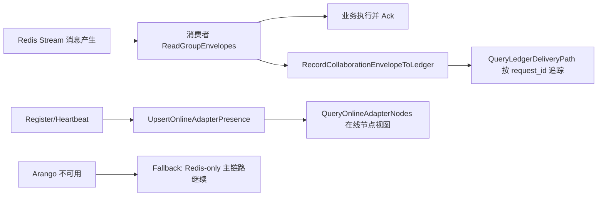
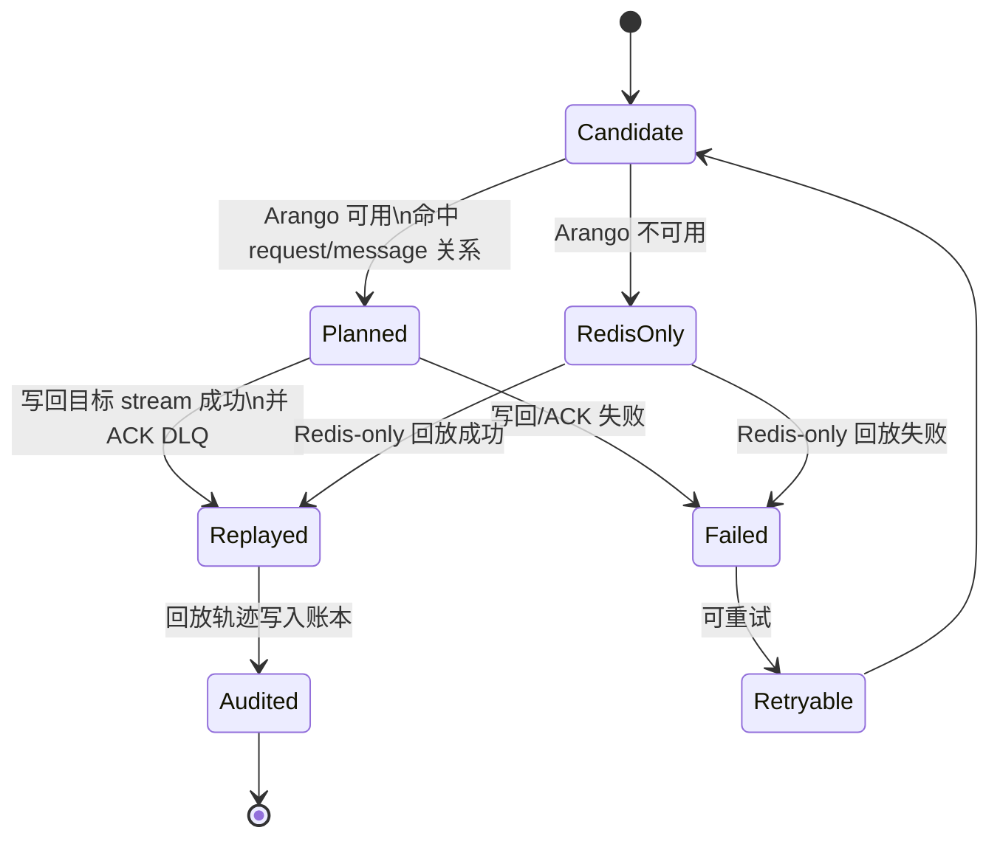
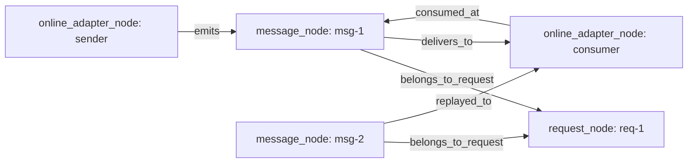

# ArangoDB Adapter

## 概述

ArangoDB 适配器在 EIT-DB 中承担两部分职责：

1. AQL 透传执行（文档/图查询）。
2. 协作层账本与在线节点投影（Redis 协作链路的持久追踪面）。

在协作层 vNext 口径中，Arango 是默认增强面：

1. 默认随协作层启动，用于链路追踪、关系审计、回放辅助。
2. 若 Arango 不可用，系统进入 fallback（Redis-only）模式，保证主链路可用但可观测性降级。

- 适配器标识：`arango`
- 访问方式：HTTP API + AQL
- 典型场景：协作消息账本、在线节点快照、跨适配器链路审计

关系语义支持等级：强支持（图/文档关系语义为 first-class）。

> vNext 方向：对外 API 将逐步收敛为后端无关的统一 `Query/Exec` 入口，由适配器自动映射到 AQL/文档查询语义；本文中的 `ExecuteAQL` 可视为当前阶段显式能力入口与兼容路径。

## 快速开始

```go
cfg := &db.Config{
    Adapter: "arango",
    Arango: &db.ArangoConnectionConfig{
        URI:            "http://127.0.0.1:58529",
        Database:       "_system",
        Username:       "root",
        Password:       "",
        Namespace:      "collab_demo",
        TimeoutSeconds: 10,
    },
}

repo, err := db.NewRepository(cfg)
if err != nil {
    panic(err)
}
defer repo.Close()

if err := repo.Connect(context.Background()); err != nil {
    panic(err)
}
```

## 连接配置

```yaml
database:
    adapter: arango
    arango:
        uri: http://127.0.0.1:58529
        database: _system
        username: root
        password: ""
        namespace: collab_prod
        timeout_seconds: 10
```

关键字段：

1. `uri`：Arango 服务地址。
2. `database`：逻辑数据库，默认 `_system`。
3. `namespace`：协作账本集合前缀隔离。
4. `timeout_seconds`：HTTP 请求超时。

## 普通应用场景能力矩阵

Arango 在 EIT-DB 中适合文档与图关系查询，也可作为协作账本存储；但当前适配器仍是 MVP 边界，重点在 AQL 和协作链路能力。

### 1) 数据库能力矩阵（DatabaseFeatures）

| 能力 | 状态 | 说明 |
|---|---|---|
| 复合索引 | ✅ | 支持 |
| 部分索引 | ✅ | 支持 |
| 外键 / 复合外键 | ❌ | 非关系型外键模型 |
| 原生 JSON | ✅ | 文档模型原生支持 |
| JSONPath / JSON 索引 | ✅ | AQL 与索引能力支持 |
| 全文搜索 | ✅ | 支持文本检索能力 |
| 函数与聚合 | ✅ | AQL 函数与聚合 |
| RETURNING 语义 | ✅ | AQL 返回语义支持 |
| UPSERT | ✅ | AQL UPSERT |

### 2) 查询能力矩阵（QueryFeatures）

| 能力 | 状态 | 说明 |
|---|---|---|
| IN / BETWEEN / LIKE / GROUP BY | ✅ | AQL 路径支持 |
| 子查询 / 关联子查询 | ✅ | AQL 路径支持 |
| UNION / EXCEPT / INTERSECT | ✅ | AQL 路径支持 |
| JOIN（SQL 语义） | ❌ | 非 SQL JOIN 语义 |
| 图关系 JOIN（文档/图语义） | ✅ | 与 Neo4j 一样属于 first-class 图关系能力 |
| CTE / 递归 CTE / 窗口函数 | ❌ | 当前不作为标准路径 |

口径说明：

1. `QueryFeatures` 中的 JOIN 统计按 SQL JOIN 口径；因此 Arango 与 Neo4j 都不会在该字段上表现为“全量 SQL JOIN 支持”。
2. 在图关系语义层（路径遍历、关系关联）上，Arango 与 Neo4j 都是 first-class 支持。
3. 对于从 SQL 报表迁移过来的 JOIN 查询，建议重写为 AQL 图/文档关联语义。

### 3) 业务场景适配矩阵

| 场景 | 适配度 | 推荐方式 |
|---|---|---|
| 文档读写与过滤 | 高 | `ExecuteAQL` |
| 图关系遍历与关联分析 | 高 | AQL 图查询 |
| 协作消息账本与审计 | 高 | `RecordCollaborationEnvelopeToLedger` |
| 在线节点监控快照 | 高 | `UpsertOnlineAdapterPresence` + `QueryOnlineAdapterNodes` |
| 传统 SQL 事务型 CRUD | 中 | 可用但不建议按 SQL 心智建模 |
| SQL JOIN 报表直接迁移 | 低 | 建议重写为 AQL 文档/图语义 |

## AQL 执行

```go
arango, _ := repo.GetAdapter().(*db.ArangoAdapter)

rows, err := arango.ExecuteAQL(ctx,
    "FOR d IN users FILTER d.active == true RETURN d",
    map[string]interface{}{},
)
if err != nil {
    panic(err)
}

fmt.Println("rows:", len(rows))
```

说明：

1. 当前适配器提供 `ExecuteAQL` 作为核心执行入口。
2. SQL 风格 `Query/Exec` 不作为主要路径，建议使用 AQL 或 `ExecuteAuto` 路由。
3. 后续统一 API 改造会把入口聚焦到后端无关语义，不再要求业务代码按后端类型显式选择执行函数。

## 协作账本能力

### 协作消息完整流程（Arango 增强视角）



### 回放判定状态机（Arango 增强优先）



说明：

1. 默认优先走 Arango 增强路径（关系筛选回放候选 + 审计落账）。
2. Arango 不可用时自动退化到 Redis-only，不阻断主链路恢复。
3. `Retryable -> Candidate` 形成闭环，支持治理策略按批次重放。

### 回放会话与断点模型（Arango-first）

回放增强模式下，Redis 负责实时搬运，Arango 负责事实记录与断点语义：

1. `replay_session_node`：一次回放会话（request、planned_by、stream、状态、时间范围）。
2. `replay_checkpoint_node`：断点锚点（anchor_type、anchor_value、tick、cursor）。
3. `session_replays_message`：会话到 message 的有序回放关系（含 seq 与时间）。
4. `session_has_checkpoint`：会话与断点关系，用于断点续跑与跳转。

Redis-only 降级模式：

1. 只保留当前版本的 request_id 过滤回放能力。
2. 不保证断点跳转、时序关系完整审计。
3. 事件仅输出摘要，避免 Redis 承担大规模历史明细。

### 断点续跑与任意锚点跳转查询接口

Arango 适配器已提供以下查询接口，用于回放执行层接线：

1. `QueryReplaySessionMessages(sessionID, fromSeq, limit)`：按会话顺序读取回放消息。
2. `QueryReplaySessionCheckpoints(sessionID, limit)`：读取会话断点列表。
3. `QueryReplayMessagesFromCheckpoint(checkpointID, includeAnchor, limit)`：从断点锚点查询后续可回放消息（可选包含锚点）。

Go 调用示例：

```go
arango, _ := repo.GetAdapter().(*db.ArangoAdapter)

rows, err := arango.QueryReplayMessagesFromCheckpoint(ctx, "cp-20260428-001", false, 200)
if err != nil {
    panic(err)
}
for _, row := range rows {
    fmt.Printf("session=%v seq=%v msg=%v\n", row["session_id"], row["seq"], row["message"])
}
```

示例 AQL（按 checkpoint 跳转提取序列）：

```aql
LET checkpoint = DOCUMENT(CONCAT(@checkpointCollection, "/", @checkpointId))
FILTER checkpoint != null
LET sessionDocId = CONCAT(@sessionCollection, "/", checkpoint.session_id)
LET anchorSeq = FIRST(
  FOR e IN collab_demo__session_replays_message
    FILTER e._from == sessionDocId
    LET m = DOCUMENT(e._to)
    FILTER m._key == checkpoint.anchor_value
    RETURN e.seq
)
FOR edge IN collab_demo__session_replays_message
  FILTER edge._from == sessionDocId
  FILTER anchorSeq == null OR edge.seq > anchorSeq
  LET msg = DOCUMENT(edge._to)
  SORT edge.seq ASC
  LIMIT 200
  RETURN { seq: edge.seq, message: msg }
```

### request_id 维度图查询示例



示例 AQL（按 `request_id` 还原投递/消费/回放轨迹）：

```aql
FOR req IN collab_demo__request_node
  FILTER req._key == @requestId
  FOR rel IN collab_demo__belongs_to_request
    FILTER rel._to == req._id
    LET msg = DOCUMENT(rel._from)
    LET sender = FIRST(
      FOR e IN collab_demo__emits
        FILTER e._to == msg._id
        RETURN DOCUMENT(e._from)
    )
    LET receiver = FIRST(
      FOR d IN collab_demo__delivers_to
        FILTER d._from == msg._id
        RETURN DOCUMENT(d._to)
    )
    SORT msg.sent_at ASC
    RETURN {
      request_id: req._key,
      message_id: msg._key,
      event_type: msg.event_type,
      stream: msg.stream,
      retry_count: msg.retry_count,
      sent_at: msg.sent_at,
      delivered_at: msg.delivered_at,
      sender_node: sender != null ? sender._key : null,
      receiver_node: receiver != null ? receiver._key : null
    }
```

### 1) 初始化账本集合

```go
arango, _ := repo.GetAdapter().(*db.ArangoAdapter)
_ = arango.EnsureCollaborationLedgerCollections(ctx)
```

默认集合（带 namespace 前缀）：

1. `online_adapter_node`
2. `request_node`
3. `message_node`
4. `replay_session_node`
5. `replay_checkpoint_node`
6. `emits`
7. `delivers_to`
8. `belongs_to_request`
9. `session_replays_message`
10. `session_has_checkpoint`

### 2) 消息入账与链路查询

```go
env := &db.CollaborationMessageEnvelope{
    MessageID:      "msg-1",
    RequestID:      "req-1",
    TraceID:        "trace-1",
    SenderNodeID:   "adapter-api",
    ReceiverNodeID: "adapter-postgres-1",
    EventType:      "query.requested",
    IdempotencyKey: "idem-1",
    Stream:         "collab:demo:request",
    TicksSent:      1,
}

_ = arango.RecordCollaborationEnvelopeToLedger(ctx, env)

paths, _ := arango.QueryLedgerDeliveryPath(ctx, "req-1", 20)
fmt.Println("path rows:", len(paths))
```

### 3) 在线节点投影

```go
_ = arango.UpsertOnlineAdapterPresence(ctx, &db.CollaborationAdapterNodePresence{
    NodeID:      "adapter-postgres-1",
    AdapterType: "postgres",
    AdapterID:   "managed-postgres",
    Group:       "adapter-postgres",
    Namespace:   "collab_demo",
    Status:      "online",
})

onlineRows, _ := arango.QueryOnlineAdapterNodes(ctx, "online", 100)
fmt.Println("online:", len(onlineRows))
```

## 协作模式实践建议

1. Redis 负责实时消息与节点管理，Arango 负责持久追踪与审计查询。
2. 生产建议默认启用 Arango；将“无 Arango”视为降级模式而非常态部署。
3. 每个环境使用独立 `namespace`，避免账本数据混杂。
4. 将 `request_id` 作为核心查询键，统一链路排障入口。
5. 结合 `blueprint_tick`/`route_tick` 元数据记录调度决策演化。

## 限制与注意事项

1. 当前适配器聚焦协作账本与 AQL 执行，非完整 ORM 语义。
2. 若 AQL 游标出现 `hasMore=true`，MVP 路径不做自动分页拉取。
3. 生产环境建议开启认证，并通过配置显式设置用户名/密码。

## 测试建议

集成测试可参考：

1. `adapter-application-tests/collaboration_arango_integration_test.go`
2. `adapter-application-tests/collaboration_monitor_tree_integration_test.go`

快速运行（示例）：

```bash
cd adapter-application-tests
REDIS_PORT=56379 POSTGRES_PORT=55432 ARANGO_PORT=58529 go test ./... -run 'Arango|UnifiedManagementPath' -count=1
```
